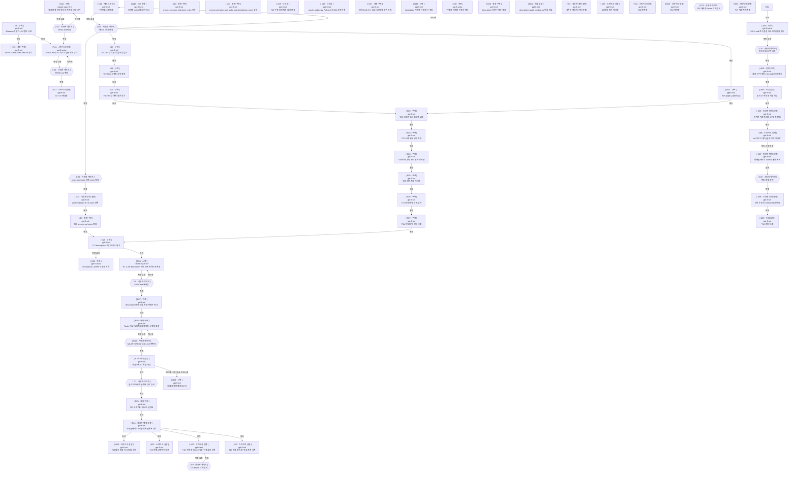

버전 : 0.11.0

| 노드 ID | 종류 | 프로필 | 입력 | 결과 파일 | 합격 기준 | 진행 조건 | 워크스페이스 | 되돌리기 | 재시도 | 검토 라운드 | 게이트 | 상태 | agentId |
| --- | --- | --- | --- | --- | --- | --- | --- | --- | --- | --- | --- | --- | --- |
| N9 | 워커 | 구현 — 원인이 특정된 결함 수정·검증 | 리더 브리핑 | nodes/N9.md / nodes/N9.failure.md | `~/.skywork/skill-trigger-eval/`의 수정 사본이 Windows에서 2질의 평가를 끝까지 돌려 `summary.total`=2 JSON을 냈는지 확인한다 | 즉시 | 공유(local) | 아니오 | 불가 | 해당 없음 | — | 완료 | d58f1379-1f96-4b25-b3ba-978a936ee3ef |
| N10 | 워커 | 경량 구현 — 정해진 문서 두 파일 수정 | nodes/N9.md | AGENTS.md · SPEC.md / nodes/N10.failure.md | `AGENTS.md:69` 줄에 개발 환경·사본 경로가 들어가고 `SPEC.md` A6 명령이 WSL 없이 사본 기준 Windows 명령으로 바뀌었는지 확인한다 | N9 완료 | 공유(local) | 아니오 | 가능 · 한도 1 · 사용 0 | 해당 없음 | — | 완료 | 9c441f11-7b27-410f-a3db-2e1759ed6245 |
| N11 | 워커 | 스파이크 설계 — 실험 설계 변경 | nodes/N9.md · nodes/N8.failure.md · spike-logs/snapshot-comparison.txt · nodes/N12.md · nodes/N12.failure.md · SPEC.md | SPIKE.md / nodes/N11.failure.md | `SPIKE.md`에서 WSL 전제가 사라지고 Windows 사본 기준 절차·스냅숏 비교 수정이 반영됐으며, 재작업 후 후보 description이 확정 SPEC의 트리와 같고 `file-history/`·`.claude.json.backup.*` 제외와 플러그인 격리 확인이 반영됐는지 확인한다 | N9 완료 · G2 확정 | 공유(local) | 아니오 | 가능 · 한도 1 · 사용 0 | 해당 없음 | — | 완료 | e4f3d0a5-e195-4aa3-85a5-32b04741751f |
| N13 | 워커 | 스펙 — 요구사항·수용 기준 변경 | 리더 브리핑 · SPEC.md | SPEC.md · nodes/N13.questions.md / nodes/N13.failure.md | `SPEC.md` 적용 판정 트리에 다단계 작업 조건이 들어가고 description·A6 평가 세트·관련 수용 기준이 그 트리와 어긋나지 않는지 확인한다 | 즉시 | 공유(local) | 아니오 | 가능 · 한도 1 · 사용 0 | 해당 없음 | — | 완료 | b4200b06-222d-4ff9-9a43-03ad929ce5b7 |
| G2 | 사용자 게이트 | — | SPEC.md | SPEC.md | 확정 대상 경로와 검토 시점 내용 해시를 적었는지 확인한다 | N13 완료 | 공유(local) | 아니오 | 불가 | 해당 없음 | SPEC.md · — · sha256 84e9f02b7f5c2dce · 확정 | 완료 | |
| G1 | 사용자 게이트 | — | SPIKE.md | SPIKE.md | 확정 대상 경로와 검토 시점 내용 해시를 적었는지 확인한다 | N11 완료 | 공유(local) | 아니오 | 불가 | 해당 없음 | SPIKE.md · — · sha256 e528ee21bb454007 · 확정(사용자 지시로 게이트 생략) | 완료 | |
| N12 | 워커 | 스파이크 실행 — 확정된 실험 실행 | SPIKE.md | nodes/N12.md / nodes/N12.round4.failure.md | U1~U3 각각의 판정(통과·실패·미판정)과 측정값·`claude -p` 사용 횟수가 결과 파일에 있는지 확인한다 | G1 확정 | 공유(local) | 아니오 | 불가 | 해당 없음 | — | 완료 | 0236258c-639b-41ef-88ff-492274fca12c |
| N16 | 워커 | 태스크 분해 — 확정 스펙을 세션 단위 태스크로 분해 | SPEC.md · nodes/N12.md | MILESTONE01-Tasks.md / nodes/N16.failure.md | `MILESTONE01-Tasks.md`가 SPEC 요구사항·수용 기준을 빠짐없이 태스크에 배정하고, 각 태스크가 대상 파일·완료 조건·검증 방법을 다른 문서 없이 알 수 있게 담았는지 확인한다 | 즉시(사용자가 마일스톤 생략 결정) | 공유(local) | 아니오 | 가능 · 한도 1 · 사용 0 | 해당 없음 | — | 완료 | eb79444e-6860-4876-86bd-6d72e6118802 |
| G5 | 사용자 게이트 | — | MILESTONE01-Tasks.md | MILESTONE01-Tasks.md | 확정 대상 경로와 검토 시점 내용 해시를 적었는지 확인한다 | N16 완료 | 공유(local) | 아니오 | 불가 | 해당 없음 | MILESTONE01-Tasks.md · — · sha256 da5a024e9d21ff90 · 확정 | 완료 | |
| N17 | 워커 | 구현 — 확정 설계·수용 기준으로 다중 파일 변경 | MILESTONE01-Tasks.md T01 · SPEC.md | SKILL.md · assets/review-briefing.md / nodes/N17.failure.md | MILESTONE01-Tasks.md T01의 완료 조건을 검증 방법 명령 출력으로 충족하는지 확인한다 | G5 확정 | 공유(local) | 아니오 | 가능 · 한도 1 · 사용 0 | 해당 없음 | — | 완료 | c3f5d366-c393-4d2b-a3c6-b8ba10550928 |
| N18 | 워커 | 구현 — 확정 설계·수용 기준으로 다중 파일 변경 | MILESTONE01-Tasks.md T02 · SPEC.md | SKILL.md · references/FORM.md / nodes/N18.failure.md | MILESTONE01-Tasks.md T02의 완료 조건을 검증 방법 명령 출력으로 충족하는지 확인한다 | N17 완료 | 공유(local) | 아니오 | 가능 · 한도 1 · 사용 0 | 해당 없음 | — | 완료 | ae440d55-3019-4ff9-bdd7-46888f65dba8 |
| G6 | 사용자 게이트 | — | list_profiles 조회값 | 실제 team-lead·spec notes | 사용자가 승인한 notes 문구와 profile-setup 적용 여부를 적었는지 확인한다 | G5 확정(사용자 승인 병렬화) | 공유(local) | 예 | 불가 | 해당 없음 | team-lead·spec notes 문구 · — · 사용자 승인(profile-setup 등록 포함) | 완료 |  |
| N19 | 워커 | 경량 구현 — 정해진 문서 한 파일 수정 | MILESTONE01-Tasks.md T03 · list_profiles 조회값 | references/presets.md / nodes/N19.failure.md | presets.md의 team-lead·spec notes가 list_profiles 실제 notes와 문자 단위로 같은지 확인한다 | N34 완료 | 공유(local) | 아니오 | 가능 · 한도 1 · 사용 0 | 해당 없음 | — | 완료 | 1b8eca90-29b6-432e-bb14-8b5df444b779 |
| N20 | 워커 | 구현 — 확정 설계·수용 기준으로 다중 파일 변경 | MILESTONE01-Tasks.md T04 · SPEC.md | SKILL.md · references/level1·level2·brainstorming.md / nodes/N20.failure.md | MILESTONE01-Tasks.md T04의 완료 조건을 검증 방법 명령 출력으로 충족하는지 확인한다 | N18 완료 | 공유(local) | 아니오 | 가능 · 한도 1 · 사용 0 | 해당 없음 | — | 완료 | 684ba30f-e78b-435d-aaa1-b18acbb1b8ad |
| N21 | 워커 | 구현 — 확정 설계·수용 기준으로 다중 파일 변경 | MILESTONE01-Tasks.md T05 · SPEC.md | scripts/graph_update.py / nodes/N21.failure.md | MILESTONE01-Tasks.md T05의 완료 조건을 검증 방법 명령 출력으로 충족하는지 확인한다 | G5 확정(사용자 승인 병렬화) | 공유(local) | 아니오 | 가능 · 한도 1 · 사용 0 | 해당 없음 | — | 완료 | e323b21b-1ec7-4e9d-96b7-2ede15d068af |
| N22 | 워커 | 구현 — 확정 설계·수용 기준으로 다중 파일 변경 | MILESTONE01-Tasks.md T06 · SPEC.md | SKILL.md · references/level1·level2·failure-handling.md / nodes/N22.failure.md | MILESTONE01-Tasks.md T06의 완료 조건을 검증 방법 명령 출력으로 충족하는지 확인한다 | N20 완료 · N21 완료 | 공유(local) | 아니오 | 가능 · 한도 1 · 사용 0 | 해당 없음 | — | 완료 | 5a23bc82-8891-41fb-a670-d9784f7cdd51 |
| N23 | 워커 | 구현 — 확정 설계·수용 기준으로 다중 파일 변경 | MILESTONE01-Tasks.md T07 · SPEC.md | SKILL.md · references/level2.md / nodes/N23.failure.md | MILESTONE01-Tasks.md T07의 완료 조건을 검증 방법 명령 출력으로 충족하는지 확인한다 | N22 완료 | 공유(local) | 아니오 | 가능 · 한도 1 · 사용 0 | 해당 없음 | — | 완료 | 59d36c2c-261d-4416-9907-555ac967ffdc |
| N24 | 워커 | 구현 — 확정 설계·수용 기준으로 다중 파일 변경 | MILESTONE01-Tasks.md T08 · SPEC.md | SKILL.md · references/level2·failure-handling·FORM.md / nodes/N24.failure.md | MILESTONE01-Tasks.md T08의 완료 조건을 검증 방법 명령 출력으로 충족하는지 확인한다 | N23 완료 | 공유(local) | 아니오 | 가능 · 한도 1 · 사용 0 | 해당 없음 | — | 완료 | 61958966-0d01-4c00-9b46-e352a2d9e3f0 |
| N25 | 워커 | 구현 — 확정 설계·수용 기준으로 다중 파일 변경 | MILESTONE01-Tasks.md T09 · SPEC.md | SKILL.md · references/level1·level2·system-prompt.md / nodes/N25.failure.md | MILESTONE01-Tasks.md T09의 완료 조건을 검증 방법 명령 출력으로 충족하는지 확인한다 | N24 완료 | 공유(local) | 아니오 | 가능 · 한도 1 · 사용 0 | 해당 없음 | — | 완료 | 5cbb2f0c-739a-4935-b150-b03f005533d3 |
| N26 | 워커 | 구현 — 확정 설계·수용 기준으로 다중 파일 변경 | MILESTONE01-Tasks.md T10 · SPEC.md | nodes/N26.md · link-audit.py (소스는 오류 시) / nodes/N26.failure.md | MILESTONE01-Tasks.md T10의 완료 조건을 검증 방법 명령 출력으로 충족하는지 확인한다 | N25 완료 | 공유(local) | 아니오 | 가능 · 한도 1 · 사용 0 | 해당 없음 | — | 완료 | ee14b348-e282-4bbd-bf1a-f1631b0bb566 |
| N27 | 워커 | 구현 — 확정 설계·수용 기준으로 다중 파일 변경 | MILESTONE01-Tasks.md T11 · SPEC.md | rule-audit.md · rule-audit.py · nodes/N27.md (소스는 오류 시) / nodes/N27.failure.md | MILESTONE01-Tasks.md T11의 완료 조건을 검증 방법 명령 출력으로 충족하는지 확인한다 | N26 완료 | 공유(local) | 아니오 | 가능 · 한도 1 · 사용 0 | 해당 없음 | — | 완료 | 704f75ba-2eba-46eb-969e-6fe183caa033 |
| N28 | 워커 | 구현 — 확정 설계·수용 기준으로 다중 파일 변경 | MILESTONE01-Tasks.md T12 · SPEC.md | SKILL.md description · a6-eval.json · a6-result.json · a6-stderr.log (재실행 시 a6-rerun-*) · nodes/N28.md / nodes/N28.failure.md | MILESTONE01-Tasks.md T12의 완료 조건을 검증 방법 명령 출력으로 충족하는지 확인한다 | N27 완료 · N19 완료 · A6 측정 수단을 실제 스킬 설치 직접 측정으로 변경(사용자 승인, SPEC.md 불변) | 공유(local) | 아니오 | 가능 · 한도 1 · 사용 0 | 해당 없음 | — | 완료 | 7924517f-c52a-48a8-8ec7-bfdcb804dd2b |
| G7 | 사용자 게이트 | — | 변경 규모 판정 | 두 plugin.json version | 승인된 버전 값과 설치본 갱신 승인을 적었는지 확인한다 | N28 완료 | 공유(local) | 예 | 불가 | 해당 없음 | 0.12.0(minor) · 설치본 갱신 승인 · 설치 경로 B(두 마켓플레이스를 워크트리 로컬 경로로 임시 전환, 실측 뒤 GitHub 복원) · 리뷰 합격 뒤 중간 커밋 승인 | 완료 |  |
| N29 | 워커 | 경량 구현 — 정해진 설정 두 파일 수정 | MILESTONE01-Tasks.md T13 · G7 승인값 | 두 plugin.json / nodes/N29.failure.md | 두 plugin.json version 0.12.0·name·description 일치, codex skills 유지, claude plugin validate(플러그인·마켓플레이스) 오류 0을 확인한다 | G7 확정 | 공유(local) | 아니오 | 불가 | 해당 없음 | — | 완료 | b2b35c42-7380-4126-b6a4-e59af53b53fc |
| N30 | 워커 | 스파이크 실행 — 확정된 실험 실행 | MILESTONE01-Tasks.md T14 · SPEC.md A8 | nodes/N30.md / nodes/N30.failure.md | MILESTONE01-Tasks.md T14 완료 조건의 측정값·판정이 결과 파일에 있는지 확인한다 | N29 완료 | 공유(local) | 아니오 | 불가 | 해당 없음 | — | 완료 | 08a7eafa-0a82-4699-b3bb-7de96b80f831 |
| N31 | 워커 | 스파이크 실행 — 확정된 실험 실행 | MILESTONE01-Tasks.md T15 · SPEC.md A8 | nodes/N31.md / nodes/N31.failure.md | MILESTONE01-Tasks.md T15 완료 조건의 측정값·판정이 결과 파일에 있는지 확인한다 | N29 완료 | 공유(local) | 아니오 | 불가 | 해당 없음 | — | 완료 | 5fe40d40-27c8-4ee8-88f2-cfa93d53cbcd |
| N32 | 워커 | 스파이크 실행 — 확정된 실험 실행 | MILESTONE01-Tasks.md T16 · SPEC.md A8 | nodes/N32.md / nodes/N32.failure.md | MILESTONE01-Tasks.md T16 완료 조건의 측정값·판정이 결과 파일에 있는지 확인한다 | N29 완료 · G8 확정(삭제 단계) | 공유(local) | 아니오 | 불가 | 해당 없음 | — | 완료 | f5aacb29-24c5-4901-b5d4-d6eca46caa0e |
| N33 | 워커 | 스파이크 실행 — 확정된 실험 실행 | MILESTONE01-Tasks.md T17 · SPEC.md A8 | nodes/N33.md / nodes/N33.failure.md | MILESTONE01-Tasks.md T17 완료 조건의 측정값·판정이 결과 파일에 있는지 확인한다 | N29 완료 | 공유(local) | 아니오 | 불가 | 해당 없음 | — | 완료 | 1adbc472-ada8-495c-bee7-b8815636078a |
| G8 | 사용자 게이트 | — | N32 승인 요청 시점 | $fixture/port.lock 삭제 | 사용자 명시 승인과 승인 전 해시를 적었는지 확인한다 | N32 승인 요청 | 공유(local) | 예 | 불가 | 해당 없음 | — | 완료 | |
| N34 | 워커 | 적응형 명령 실행 — 워크스페이스 밖 환경 작업 | G6 승인 문구 | Paseo agentProfiles(team-lead·spec notes) / nodes/N34.failure.md | list_profiles의 team-lead·spec notes가 승인 문구와 문자 단위로 같고 다른 프로필·필드가 불변인지 확인한다 | G6 확정 | 공유(local) | 예(승인됨) | 불가 | 해당 없음 | — | 완료 | 2af757a0-510f-41a0-92d7-80d4cbf86067 |
| N35 | 워커 | 자문 — 사용자가 목적 승인(description 길이 적정성) | SKILL.md · SPEC.md R1-2·R1-10·A6 | nodes/N35.md / nodes/N35.failure.md | 약 1,000자 description의 적정성 판단과 근거(공식 문서·skill-creator 지침)가 결과 파일에 있는지 확인한다 | 사용자 승인 | 공유(local) | 아니오 | 불가 | 해당 없음 | — | 완료 | d81a7bd4-bdf9-4163-90de-bbde74ce0e6c |
| N36 | 워커 | 스펙 — 요구사항·수용 기준 변경 | SPEC.md · nodes/N35.md | SPEC.md · nodes/N36.questions.md / nodes/N36.failure.md | SPEC.md R1-2·A6가 자문 선택지 1(본문 트리 원문 유지, description 의미 보존 축약, 조건별 포함 확인+행동 평가)로 바뀌고 다른 요구사항과 어긋나지 않는지 확인한다 | N28 완료 · 사용자 지시 | 공유(local) | 아니오 | 가능 · 한도 1 · 사용 0 | 해당 없음 | — | 완료 | 44759d45-fd01-4fb0-bfb6-3178451c6b62 |
| G9 | 사용자 게이트 | — | SPEC.md | SPEC.md | 확정 대상 경로와 검토 시점 내용 해시를 적었는지 확인한다 | N36 완료 | 공유(local) | 아니오 | 불가 | 해당 없음 | SPEC.md · — · sha256 a1acb66b465ab3db · 확정 | 완료 |  |
| N37 | 워커 | 구현 — 확정 설계·수용 기준으로 다중 파일 변경 | SPEC.md(재확정) · a6-direct/ · backup/SKILL.md.desc987 | SKILL.md description · a6-short-*.json/log · nodes/N37.md / nodes/N37.failure.md | 축약 description이 재확정 A6 정적 조건을 통과하고 같은 평가 세트·직접 측정에서 A6 통과 여부와 987자판 비교가 결과 파일에 있는지 확인한다 | G9 확정 | 공유(local) | 아니오 | 가능 · 한도 1 · 사용 0 | 해당 없음 | — | 완료 | b92b7707-c88c-4298-8c66-476696744066 |
| N38 | 워커 | 경량 구현 — 정해진 문서 한 파일 수정 | SPEC.md(a1acb66b) · nodes/N36.questions.md · nodes/N37.md | MILESTONE01-Tasks.md / nodes/N38.failure.md | MILESTONE01-Tasks.md T01·T12의 충돌 줄이 재확정 SPEC R1-2·A6·C3와 맞고 다른 줄은 불변인지 확인한다 | N37 채택(사용자) | 공유(local) | 아니오 | 가능 · 한도 1 · 사용 0 | 해당 없음 | — | 완료 | 63337849-7d56-4ce4-addd-5d40f20be806 |
| G10 | 사용자 게이트 | — | MILESTONE01-Tasks.md | MILESTONE01-Tasks.md | 확정 대상 경로와 검토 시점 내용 해시를 적었는지 확인한다 | N38 완료 | 공유(local) | 아니오 | 불가 | 해당 없음 | MILESTONE01-Tasks.md · — · sha256 607c4972a82a167f · 확정 | 완료 |  |
| N39 | 워커 | 리뷰·검증 — 변경을 수용 기준과 대조, 대상 수정 안 함 | SPEC.md(a1acb66b) · git diff 5e833be | nodes/N39.md (2라운드 nodes/N39.round2.md) / nodes/N39.failure.md (2라운드 nodes/N39.round2.failure.md) | 결과 파일 첫 줄 구분 표지와 R1~R9·C1~C5·A1~A6 대조 판정·근거가 있는지 확인한다 | G10 확정 · 2라운드 지적(RUN/.gitattributes 범위 밖 추가)을 사용자 판단으로 비차단 수용해 리뷰 종료 | 공유(local) | 아니오 | 불가 | 상한 3 · 사용 2 | — | 완료 | 33d98ad4-4a28-44f2-ba11-0df2b6ece856 |
| N40 | 워커 | 구현 — 리뷰 지적 반영 | nodes/N39.md | m01-review.round2.patch / nodes/N40.failure.md | 리뷰 지적이 해소되고 정적 검사가 통과하는지 재검토로 확인한다 | N39 수정 필요 판정 | 공유(local) | 아니오 | 가능 · 한도 1 · 사용 0 | 해당 없음 | — | 완료 | 603c0e92-8788-4540-b567-3397aad2dc8d |
| N41 | 워커 | 적응형 명령 실행 — 워크스페이스 밖 환경 작업 | G7 승인(경로 B) · N29 결과 | 설치본(claude·codex) · nodes/N41.md / nodes/N41.failure.md | 두 마켓플레이스가 워크트리 로컬 경로를 가리키고 설치본 paseo-toolkit 0.12.0이 저장소 판본과 일치하며 원래 출처 설정이 기록됐는지 확인한다 | N29 완료 | 공유(local) | 예(승인됨) | 불가 | 해당 없음 | — | 완료 | 71c2df0e-9a38-4102-b0da-2c12915c1c91 |
| N42 | 워커 | 단순 탐색 — 프로필 notes 대조 | presets.md · 리더 브리핑(이 PC list_profiles 값) | nodes/N42.md / nodes/N42.failure.md | 이 PC의 team-lead·spec notes가 presets.md의 두 notes와 문자 단위로 같은지 근거와 함께 판정했는지 확인한다 | 즉시 | 공유(local) | 아니오 | 가능 · 한도 1 · 사용 0 | 해당 없음 | — | 완료 | 000aeafc-72ea-410e-8004-a1fe55ca8a50 |
| N43 | 워커 | 경량 구현 — presets.md notes 두 줄 교체 | 리더 브리핑(사용자 승인 축약안) | plugins/paseo-toolkit/references/presets.md / nodes/N43.failure.md | presets.md:240·256의 notes가 승인 축약안과 문자 단위로 같고 다른 줄 변경이 없는지 확인한다 | 즉시 | 공유(local) | 아니오 | 불가 | 해당 없음 | — | 완료 | ae91ede1-265d-4271-8c97-19df8f2ff92d |
| N44 | 워커 | 경량 구현 — presets.md notes 세 줄 교체 | 리더 브리핑(사용자 승인 축약안) | plugins/paseo-toolkit/references/presets.md / nodes/N44.failure.md | 세 notes가 승인 문구와 문자 단위로 같고 다른 줄 변경이 없는지 확인한다 | 즉시 | 공유(local) | 아니오 | 불가 | 해당 없음 | — | 완료 | d752748f-bbda-49f4-9066-bb0ffa926e9a |
| N45 | 워커 | 디버깅 — 원인 분석(수정 없음) | nodes/N32.md · a8-logs/N32/ | nodes/N45.md / nodes/N45.failure.md | T16의 두 실패(삭제 전 스킬 미로드, 직접 수정 뒤 리뷰 미기동)의 원인을 전사 근거로 특정하고 수정 대안을 제시했는지 확인한다 | 즉시 | 공유(local) | 아니오 | 불가 | 해당 없음 | — | 완료 | a5a92460-bdcc-40f3-bad8-ad059daa8a20 |
| N46 | 워커 | 디버깅 — 원인 특정·최소 수정 | a8-logs/N31/graph-self-test-py39.log | graph_update.py / nodes/N46.md / nodes/N46.failure.md | Python 3.9와 3.12 모두에서 graph_update.py --self-test가 종료 0인지 확인한다 | 즉시 | 공유(local) | 아니오 | 불가 | 해당 없음 | — | 완료 | 293deeb9-32a6-4027-921b-f457b78d467a |
| N47 | 워커 | 경량 구현 — RUN 문서 두 개 문구 교체 | 리더 브리핑(사용자 결정: T14 A안, T17 재설계) | SPEC.md · MILESTONE01-Tasks.md / nodes/N47.failure.md | 지정한 다섯 줄이 승인 문구와 문자 단위로 같고 다른 줄 변경이 없는지 확인한다 | 즉시 | 공유(local) | 아니오 | 불가 | 해당 없음 | — | 완료 | 2c383e5e-3a53-48ed-b40c-f985dff9a4d4 |
| N48 | 워커 | 구현 — description 수정 초안(적용 전) | nodes/N45.md · SPEC.md A6·R1 | nodes/N48.md / nodes/N48.failure.md | 초안이 1,024자 이하이고 A6 조건별 포함 대응과 N45 두 시점 명시를 갖췄는지 확인한다 | N45 완료 · 사용자 1안 승인 | 공유(local) | 아니오 | 불가 | 해당 없음 | — | 완료 | 450812ab-4269-445f-a4cd-a6b96aa4f68c |
| N49 | 워커 | 자문 — 사용자 승인 목적: T16 수행 중 미발동 수정안 판단 | nodes/N45.md · nodes/N48.md · a8-logs/N32/ | nodes/N49.md / nodes/N49.failure.md | 초안의 효과 예측·근거·대안 비교·권고가 결과 파일에 있는지 확인한다 | N48 완료 · 사용자 자문 승인 | 공유(local) | 아니오 | 불가 | 해당 없음 | — | 완료 | 8bfeba77-fa3a-4f6a-9248-a3d5253e5c07 |
| N50 | 워커 | 경량 구현 — SKILL.md description 한 줄 교체 | nodes/N49.md(사용자 채택 수정안) | plugins/paseo-toolkit/skills/agent-orchestration/SKILL.md / nodes/N50.failure.md | description이 N49 수정안과 문자 단위로 같고 SKILL.md 다른 줄 변경이 없으며 YAML 파싱이 되는지 확인한다 | N49 완료 · 사용자 채택 | 공유(local) | 아니오 | 불가 | 해당 없음 | — | 완료 | 601e98c7-fd8a-41e3-b1b3-cf1a1dac095d |
| N51 | 워커 | 리뷰·검증 — 독립 리뷰 | SKILL.md · graph_update.py · SPEC.md R1·R2·A6 · nodes/N49.md 수정안 | nodes/N51.md / nodes/N51.failure.md | description이 SPEC R1·R2·A6 정적 조건과 채택 문구를 충족하고 graph_update.py가 3.9·3.12 self-test 종료 0이며 동작 변경이 없는지 판정한다 | N46 완료 · N50 완료 | 공유(local) | 아니오 | 불가 | 상한 3 · 사용 1 | — | 완료 | a1590a1d-f741-441f-89ce-20e5349ef06e |
| N52 | 워커 | 적응형 명령 실행 — 설치본 재설치 | N51 합격 | 설치본(claude·codex) / nodes/N52.md / nodes/N52.failure.md | claude·codex 설치본의 paseo-toolkit가 저장소 판본과 diff 0이고 다른 설치 플러그인 목록이 유지됐는지 확인한다 | N51 합격 | 공유(local) | 아니오 | 불가 | 해당 없음 | — | 완료 | b09e0ea8-6979-4100-ba87-64b665472a93 |
| N53 | 워커 | 스파이크 실행 — A6 재평가 | SPEC.md A6 · a6-direct/evaluate.py | nodes/N53.md / nodes/N53.failure.md | SPEC A6 트리거 평가(1차·재실행)의 측정값과 통과 판정이 결과 파일에 있는지 확인한다 | N52 완료 | 공유(local) | 아니오 | 불가 | 해당 없음 | — | 완료 | 043b7e02-7405-41ef-8ecd-1612bf9c2cdd |
| N54 | 워커 | 스파이크 실행 — T14 재측정 | MILESTONE01-Tasks.md T14 · SPEC.md A8 | nodes/N54.md / nodes/N54.failure.md | MILESTONE01-Tasks.md T14 완료 조건의 측정값·판정이 결과 파일에 있는지 확인한다 | N52 완료 | 공유(local) | 아니오 | 불가 | 해당 없음 | — | 완료 | db6e8ac8-cd21-4c16-affe-e5d21f7063f8 |
| N55 | 워커 | 스파이크 실행 — T16 재측정 | MILESTONE01-Tasks.md T16 · SPEC.md A8 | nodes/N55.md / nodes/N55.failure.md | MILESTONE01-Tasks.md T16 완료 조건의 측정값·판정이 결과 파일에 있는지 확인한다 | N52 완료 · G12 확정(삭제 단계) | 공유(local) | 아니오 | 불가 | 해당 없음 | — | 완료 | 71a34c6a-7888-4455-86b2-c106e15193c1 |
| G12 | 사용자 게이트 | — | N55 승인 요청 시점 | $fixture/port.lock 삭제 | 사용자 명시 승인과 승인 전 해시를 적었는지 확인한다 | N55 승인 요청 | 공유(local) | 예 | 불가 | 해당 없음 | — | 완료 | |
| N56 | 워커 | 스파이크 실행 — T17 재설계 재측정 | MILESTONE01-Tasks.md T17 · SPEC.md A8-5 | nodes/N56.md / nodes/N56.failure.md | MILESTONE01-Tasks.md T17 완료 조건의 측정값·판정이 결과 파일에 있는지 확인한다 | N52 완료 | 공유(local) | 아니오 | 불가 | 해당 없음 | — | 완료 | f3e09095-b9ef-4bc5-b7d5-8b68df63ce40 |
| N57 | 워커 | 스파이크 실행 — A6 실패 원인 분리 | nodes/N53.md · 7f907e5 SKILL.md:3 · a6-rerun2/evaluate_macos.py | a6-cause/ · nodes/N57.md / nodes/N57.failure.md | 옛·새 description 조건별 "이 에러 원인 찾아줘" 발동 비율과 원인 판정(문구/환경·질의/불가)이 결과 파일에 있는지 확인한다 | N53 완료 · 사용자 결정(원인 분리) | 공유(local) | 아니오 | 불가 | 해당 없음 | — | 완료 | 7659cd05-d5a9-4a02-b6f9-ecdfaf143d90 |
| N58 | 워커 | 경량 구현 — RUN 문서 두 개 명시 전환 문구 | 사용자 승인 초안(SPEC R1-2·A6·A8-3·A8-5, Tasks T16·T17) | SPEC.md · MILESTONE01-Tasks.md / nodes/N58.failure.md | 11개 교체가 승인 문구와 문자 단위로 같고 다른 줄 변경이 없는지 확인한다 | 사용자 승인 | 공유(local) | 아니오 | 불가 | 해당 없음 | — | 완료 | 3df8e9de-dd96-4797-9769-23f1a09bf72c |
| N59 | 워커 | 경량 구현 — description 명시 전환 문장 삽입 | 사용자 승인 초안(993자) | plugins/paseo-toolkit/skills/agent-orchestration/SKILL.md / nodes/N59.failure.md | description이 승인 문구대로 993자이고 YAML 파싱·claude plugin validate 오류 0, 다른 줄 불변인지 확인한다 | 사용자 승인 | 공유(local) | 아니오 | 불가 | 해당 없음 | — | 완료 | e0fdf0e7-5c25-4aad-9f0f-0faaa3cd8d47 |
| N60 | 워커 | 스파이크 실행 — A6 대체 질의 발동률 사전 측정(N57 재사용) | nodes/N57.md · a6-cause/source-snapshot | a6-cause/n60-* · nodes/N60.md / nodes/N60.failure.md | 에러 맥락이 든 후보 질의 두 개와 직접 지시 대조의 발동 수/회수가 결과 파일에 있는지 확인한다 | N57 완료 | 공유(local) | 아니오 | 불가 | 해당 없음 | — | 완료 | 7659cd05-d5a9-4a02-b6f9-ecdfaf143d90 |
| N61 | 워커 | 경량 구현 — SPEC A6 필수 발동 질의 한 항목 교체 | 사용자 승인(후보 A) · nodes/N60.md | SPEC.md / nodes/N61.failure.md | A6 필수 발동 질의가 승인 문구로 한 곳만 바뀌었는지 확인한다 | N60 완료 · 사용자 승인 | 공유(local) | 아니오 | 불가 | 해당 없음 | — | 완료 | c5846f62-c29d-4067-b770-295aa00ba9c5 |
| N62 | 워커 | 리뷰·검증 — 명시 전환 변경 독립 리뷰 | 사용자 승인 문구 · SKILL.md · SPEC.md · MILESTONE01-Tasks.md | nodes/N62.md / nodes/N62.failure.md | 결과 파일 첫 줄 판정과 description 문자 일치·A6 대응·SPEC/Tasks 정합·validate 결과가 근거와 함께 있는지 확인한다 | N58·N59·N61 완료 | 공유(local) | 아니오 | 불가 | 상한 3 · 사용 2 | — | 완료 | 4cf4c633-534c-419d-968a-71f3957c5877 |
| N63 | 워커 | 경량 구현 — 리뷰 지적 반영(T17 검증 방법 한 줄, N61 재사용) | nodes/N62.md 최소 수정안 | MILESTONE01-Tasks.md / nodes/N63.failure.md | T17 검증 방법에 자동 전환 순서가 추가되고 다른 줄 변경이 없는지 재검토로 확인한다 | N62 수정 필요 판정 | 공유(local) | 아니오 | 불가 | 해당 없음 | — | 완료 | c5846f62-c29d-4067-b770-295aa00ba9c5 |
| N64 | 워커 | 적응형 명령 실행 — 설치본 재설치(993자판) | N62 합격 · G7 승인 | 설치본(claude·codex) / nodes/N64.md / nodes/N64.failure.md | claude·codex 설치본 paseo-toolkit가 저장소 판본과 diff 0이고 다른 설치 플러그인 목록이 유지됐는지 확인한다 | N62 합격 | 공유(local) | 아니오 | 불가 | 해당 없음 | — | 완료 | a2904b85-029b-4846-b3bd-5fd763294843 |
| N65 | 워커 | 스파이크 실행 — A6 재평가(명시 전환·교체 질의 반영) | SPEC.md A6 · a6-rerun2/ | a6-rerun3/ · nodes/N65.md / nodes/N65.failure.md | SPEC A6 정적 검사·1차·재실행 측정값과 통과 판정이 결과 파일에 있는지 확인한다 | N62 합격 | 공유(local) | 아니오 | 불가 | 해당 없음 | — | 완료 | 5abbc658-40ea-4fc4-86e9-963451ff95d7 |
| N66 | 워커 | 스파이크 실행 — T17 사용자 지시 전환 실측 | MILESTONE01-Tasks.md T17 · SPEC.md A8-5 | a8-logs/N66/ · nodes/N66.md / nodes/N66.failure.md | MILESTONE01-Tasks.md T17 완료 조건의 측정값·판정과 fixture 워크스페이스 정리 기록이 결과 파일에 있는지 확인한다 | N64 완료 | 공유(local) | 아니오 | 불가 | 해당 없음 | — | 실패 | d053a6d1-fb54-4350-8ab6-52180f82837f |
| G13 | 사용자 게이트 | — | 최종 시나리오 세트 설계 | 시나리오 구성·반복 횟수 · M3 fixture port.lock 삭제 사전 승인 | 사용자 명시 승인과 승인 범위를 적었는지 확인한다 | N65·N66 결과 전 초안 제시 | 공유(local) | 예 | 불가 | 해당 없음 | 사용자 원문 "너가 저대로 충분한 테스트라고 판단되면 승인할게." · 팀장 판단 충분(M4 3회차 전환 표현 "오케스트레이션으로 전환해"로 보강) · 단발 A6 세트+직접 지시 변형 질의당 5회 · M1~M5 각 3회 · T15 제외 · M3 저장소 밖 fixture mock port.lock 삭제 3회분 사전 승인(실험 워커가 원문 "승인" 전달) | 완료 |  |
| N67 | 워커 | 스파이크 실행 — T17 재측정(전사 감지·지연 검증 장치) | MILESTONE01-Tasks.md T17 · SPEC.md A8-5 · nodes/N66.md | a8-logs/N67/ · nodes/N67.md / nodes/N67.failure.md | MILESTONE01-Tasks.md T17 완료 조건의 측정값·판정, 전환 지시 처리 방식, fixture 워크스페이스 정리 기록이 결과 파일에 있는지 확인한다 | N66 판정 불가(측정 장치 결함) | 공유(local) | 아니오 | 불가 | 해당 없음 | — | 실패 | 7e7205d3-b8bc-4f06-9f77-26be1b8d59f5 |
| N68 | 워커 | 스파이크 실행 — 최종 세트 단발 발동(29질의×5회) | G13 · a6-rerun3/initial-eval.json | final-single/ · nodes/N68.md / nodes/N68.failure.md | 질의별 발동 n/5·범주별 통과율·어긋난 실행 근거가 결과 파일에 있는지 확인한다 | G13 확정 · N65 통과 | 공유(local) | 아니오 | 불가 | 해당 없음 | — | 완료 | 5bc13ac8-893a-4896-8cc7-f531203caa9c |
| N69 | 워커 | 스파이크 실행 — 직접 지시 명시 질의 5회(N68 재사용) | 사용자 지적(q29 주체 애매) · final-single/ | final-single/n69-* · nodes/N69.md / nodes/N69.failure.md | "너가 직접 이 에러 원인 찾아줘" 질의의 발동 n/5와 실행별 근거가 결과 파일에 있는지 확인한다 | N68 완료 · 사용자 제안 | 공유(local) | 아니오 | 불가 | 해당 없음 | — | 완료 | 5bc13ac8-893a-4896-8cc7-f531203caa9c |
| N70 | 워커 | 스파이크 실행 — 직접 지시 보정안 효과 비교(N68 재사용) | nodes/N69.md · 보정안(직접 지시 없이 직접 처리하던 중) | final-single/n70-* · nodes/N70.md / nodes/N70.failure.md | CUR·FIX 조건별 q30 발동 n/10과 FIX 대조 질의 발동 수가 결과 파일에 있는지 확인한다 | N69 완료 | 공유(local) | 아니오 | 불가 | 해당 없음 | — | 완료 | 5bc13ac8-893a-4896-8cc7-f531203caa9c |
| G14 | 사용자 게이트 | — | A8-5 검토 기준 재정의 | SPEC.md A8-5 · MILESTONE01-Tasks.md T17 | 사용자 명시 승인과 승인 문구를 적었는지 확인한다 | N67 결과 | 공유(local) | 아니오 | 불가 | 해당 없음 | 합류 기준 승인 → N72 지적(기존 R1-7·level2.md:320 후행 검토 규칙과 충돌)으로 사용자가 철회, 기존 규칙 유지·문구 되돌림 · 스킬 본문 불변 · 직접 지시 과발동(4/15)은 한계로 기록 · 전환 뒤 팀장 직접 수정은 후속 항목 | 완료 |  |
| N71 | 워커 | 경량 구현 — A8-5·T17 합류 기준 문구 교체(N61 재사용) | G14 승인 문구 | SPEC.md · MILESTONE01-Tasks.md / nodes/N71.failure.md | 세 곳이 승인 문구와 문자 단위로 같고 다른 줄 변경이 없는지 확인한다 | G14 확정 | 공유(local) | 아니오 | 불가 | 해당 없음 | — | 완료 | c5846f62-c29d-4067-b770-295aa00ba9c5 |
| N72 | 워커 | 리뷰·검증 — 합류 기준 문구 독립 리뷰(N62 재사용) | G14 승인 문구 · SPEC.md · MILESTONE01-Tasks.md · SKILL.md | nodes/N72.md / nodes/N72.failure.md | 결과 파일 첫 줄 판정과 세 곳 문자 일치·SPEC/Tasks/본문 정합 근거가 있는지 확인한다 | N71 완료 | 공유(local) | 아니오 | 불가 | 상한 3 · 사용 1 | — | 완료 | 4cf4c633-534c-419d-968a-71f3957c5877 |
| N73 | 워커 | 스파이크 실행 — 최종 세트 M1 짧은 조회 3회 | G13 · SPEC.md A8-1 | final-live/M1/ · nodes/N73.md / nodes/N73.failure.md | 회별 판정·통과율 n/3·계측·워크스페이스 정리 기록이 결과 파일에 있는지 확인한다 | G13 확정 | 공유(local) | 아니오 | 불가 | 해당 없음 | — | 완료 | 6ec4da62-8032-4c98-a8f5-4d5c6b7b2364 |
| N74 | 워커 | 스파이크 실행 — 최종 세트 M2 지시 충돌 3회 | G13 · SPEC.md A8-4 | final-live/M2/ · nodes/N74.md / nodes/N74.failure.md | 회별 판정·통과율 n/3·계측·워크스페이스 정리 기록이 결과 파일에 있는지 확인한다 | G13 확정 | 공유(local) | 아니오 | 불가 | 해당 없음 | — | 완료 | 872ab0be-d1ad-4c74-a6d2-fd37efed3b2e |
| N75 | 워커 | 스파이크 실행 — 최종 세트 M3 수행 중 삭제 승인 3회 | G13(port.lock 3회 사전 승인) · SPEC.md A8-3 | final-live/M3/ · nodes/N75.md / nodes/N75.failure.md | 회별 판정·통과율 n/3·계측·워크스페이스 정리 기록이 결과 파일에 있는지 확인한다 | G13 확정 | 공유(local) | 예(사전 승인) | 불가 | 해당 없음 | — | 완료 | 61fea29b-65e0-46c3-b1e3-3ea11f790570 |
| N76 | 워커 | 스파이크 실행 — 최종 세트 M4 사용자 지시 전환 3회 | G13 · G14 · SPEC.md A8-5 · a8-logs/N67/ | final-live/M4/ · nodes/N76.md / nodes/N76.failure.md | 회별 판정·통과율 n/3·시각 대조·계측·워크스페이스 정리 기록이 결과 파일에 있는지 확인한다 | G13·G14 확정 | 공유(local) | 아니오 | 불가 | 해당 없음 | — | 완료 | 0309377d-4505-4f2b-b441-06c16b06e318 |
| N77 | 워커 | 스파이크 실행 — 최종 세트 M5 단일 파일 직접 수정 검토 3회 | G13 · SPEC.md R1-7 | final-live/M5/ · nodes/N77.md / nodes/N77.failure.md | 회별 판정·통과율 n/3·계측·워크스페이스 정리 기록이 결과 파일에 있는지 확인한다 | G13 확정 | 공유(local) | 아니오 | 불가 | 해당 없음 | — | 완료 | 69ce5c96-e247-4737-8359-72799be55654 |
| N78 | 워커 | 경량 구현 — N71 세 곳 원문 되돌림(N61 재사용) | 사용자 지시(기존 규칙 유지) | SPEC.md · MILESTONE01-Tasks.md / nodes/N78.failure.md | 두 파일 blob 해시가 N62 round2 합격 시점(b2077be·02a5a4f)과 같은지 확인한다 | N72 지적 · 사용자 결정 | 공유(local) | 아니오 | 불가 | 해당 없음 | — | 완료 | c5846f62-c29d-4067-b770-295aa00ba9c5 |
| G15 | 사용자 게이트 | — | R1-7 재설계 | 경미한 수정 예외 · 전환 뒤 검토 순차 명확화 | 사용자 명시 승인과 승인 문구를 적었는지 확인한다 | M3·M4·M5 결과 | 공유(local) | 아니오 | 불가 | 해당 없음 | 순차 규칙 유지(합류 기준 기각) · 경미한 수정(한 파일 상수·설정값 한 줄 변경을 실행·테스트로 확인)은 검토 생략·생략 사실과 증빙 보고 · 적용 뒤 한 바퀴 검증 후 스킬 동결 | 완료 |  |
| N79 | 워커 | 경량 구현 — 경미한 수정 예외·검토 순서 문구(스킬 두 파일) | G15 승인 문구 | SKILL.md · references/level2.md / nodes/N79.failure.md | 6곳이 승인 문구와 같고 description 1,023자·validate 오류 0인지 확인한다 | G15 확정 | 공유(local) | 아니오 | 불가 | 해당 없음 | — | 완료 | 1f9672e2-d439-4723-a212-e76d36bc8dd2 |
| N80 | 워커 | 경량 구현 — R1-7·A8-3·T16 문구(N61 재사용) | G15 승인 문구 | SPEC.md · MILESTONE01-Tasks.md / nodes/N80.failure.md | 4곳이 승인 문구와 같고 다른 줄 변경이 없는지 확인한다 | G15 확정 | 공유(local) | 아니오 | 불가 | 해당 없음 | — | 완료 | c5846f62-c29d-4067-b770-295aa00ba9c5 |
| N81 | 워커 | 리뷰·검증 — 경미한 수정 예외·검토 순서 독립 리뷰(N62 재사용) | G15 승인 문구 · SKILL.md · level2.md · SPEC.md · MILESTONE01-Tasks.md | nodes/N81.md / nodes/N81.failure.md | 결과 파일 첫 줄 판정과 10곳 문자 일치·잔여 규칙 grep·A3/A4/A6 정적 검사·validate 근거가 있는지 확인한다 | N79·N80 완료 | 공유(local) | 아니오 | 불가 | 상한 3 · 사용 2 | — | 완료 | 4cf4c633-534c-419d-968a-71f3957c5877 |
| N82 | 워커 | 경량 구현 — description 본문 기준 참조·A6 인용 갱신(N79 재사용) | nodes/N81.md · 사용자 승인 문구 A | SKILL.md · a6-rerun3/static_check.py / nodes/N82.failure.md | description 1,010자·A6 정적 전 그룹 통과·validate 오류 0인지 확인한다 | N81 수정 필요 · 사용자 승인 | 공유(local) | 아니오 | 불가 | 해당 없음 | — | 완료 | 1f9672e2-d439-4723-a212-e76d36bc8dd2 |
| N83 | 워커 | 경량 구현 — SPEC·Tasks 경미한 수정 반영 7곳(N61 재사용) | nodes/N81.md · 사용자 승인 문구 B~H | SPEC.md · MILESTONE01-Tasks.md / nodes/N83.failure.md | 7곳이 승인 문구와 같고 다른 줄 변경이 없는지 확인한다 | N81 수정 필요 · 사용자 승인 | 공유(local) | 아니오 | 불가 | 해당 없음 | — | 완료 | c5846f62-c29d-4067-b770-295aa00ba9c5 |
| N84 | 워커 | 경량 구현 — A4 대조표 ④ 인용 갱신(N79 재사용) | nodes/N81.md · SKILL.md ④ 현행 | rule-audit.md / nodes/N84.failure.md | rule_audit_current.py 인용 불일치 0·종료 0이고 86행 외 변경이 없는지 확인한다 | N82 완료 | 공유(local) | 아니오 | 불가 | 해당 없음 | — | 완료 | 1f9672e2-d439-4723-a212-e76d36bc8dd2 |
| N85 | 워커 | 적응형 명령 실행 — 설치본 재설치(경미한 수정 예외판, N64 재사용) | N81 round2 합격 · G7 승인 | 설치본(claude·codex) / nodes/N85.md / nodes/N85.failure.md | 두 설치본이 저장소 판본과 diff 0이고 다른 플러그인 목록이 유지됐는지 확인한다 | N81 합격 | 공유(local) | 아니오 | 불가 | 해당 없음 | — | 완료 | a2904b85-029b-4846-b3bd-5fd763294843 |
| N86 | 워커 | 스파이크 실행 — A6 재평가(1,010자판, N65 재사용) | SPEC.md A6 · a6-rerun3/ | a6-rerun4/ · nodes/N86.md / nodes/N86.failure.md | SPEC A6 정적 검사·1차·재실행 측정값과 통과 판정이 결과 파일에 있는지 확인한다 | N81 합격 | 공유(local) | 아니오 | 불가 | 해당 없음 | — | 실패 | 5abbc658-40ea-4fc4-86e9-963451ff95d7 |
| N88 | 워커 | 스파이크 실행 — M4 재측정 3회(엄격 순서, N76 재사용) | G15 · SPEC.md A8-5·R1-7 · level2.md:321 | final-live2/M4/ · nodes/N88.md / nodes/N88.failure.md | 회별 판정·검토 순서 시각 대조·계측·워크스페이스 정리 기록이 결과 파일에 있는지 확인한다 | N85 완료 | 공유(local) | 아니오 | 불가 | 해당 없음 | — | 완료 | 0309377d-4505-4f2b-b441-06c16b06e318 |
| N89 | 워커 | 스파이크 실행 — M5 재측정 3회(비경미 수정 검토, N77 재사용) | G15 · SPEC.md R1-7 | final-live2/M5/ · nodes/N89.md / nodes/N89.failure.md | 회별 판정·계측·워크스페이스 정리 기록이 결과 파일에 있는지 확인한다 | N85 완료 | 공유(local) | 아니오 | 불가 | 해당 없음 | — | 완료 | 69ce5c96-e247-4737-8359-72799be55654 |
| G16 | 사용자 게이트 | — | M3 재측정 | fixture mock port.lock 삭제 3회분 | 사용자 명시 승인과 승인 범위를 적었는지 확인한다 | N85 완료 | 공유(local) | 예 | 불가 | 해당 없음 | 사용자 원문 "승인" · 저장소 밖 fixture mock port.lock 한정 · M3 재측정 3회 한정 · 실험 워커가 원문 "승인" 전달 | 완료 |  |
| N87 | 워커 | 스파이크 실행 — M3 재측정 3회(경미한 수정 생략 경로, N75 재사용) | G16 · SPEC.md A8-3·R1-7 | final-live2/M3/ · nodes/N87.md / nodes/N87.failure.md | 회별 판정·계측·워크스페이스 정리 기록이 결과 파일에 있는지 확인한다 | G16 확정 | 공유(local) | 예(사전 승인) | 불가 | 해당 없음 | — | 완료 | 61fea29b-65e0-46c3-b1e3-3ea11f790570 |
| N90 | 워커 | 구현 — SKILL.md 의미 보존 축약 후보 제안(수정 없음) | nodes/N86.md · SPEC.md A1 · 사용자 지시(SKILL.md 축약) | nodes/N90.md / nodes/N90.failure.md | 후보별 원문·새 문구·절감 수·의미 동일 근거·A4/A6/A3 영향과 적용 후 예상 문자 수 ≤ 18,744가 결과 파일에 있는지 확인한다 | N86 A1 초과 · 사용자 지시 | 공유(local) | 아니오 | 불가 | 해당 없음 | — | 완료 | e666796a-c856-46b2-90d4-416591bb4897 |
| G17 | 사용자 게이트 | — | SKILL.md 전수 점검 방식 | 리뷰 워커↔자문 토론 · 자문 사용 목적 | 사용자 명시 지시와 자문 목적 승인을 적었는지 확인한다 | N90 완료 | 공유(local) | 아니오 | 불가 | 해당 없음 | 사용자 원문 "전수 점검은 점검/리뷰 에이전트와 자문이 서로 토론해서 정할 수 있도록 하고, SKILL 사용함에 있어서 사이드 이펙트가 생기면 안됨." · 자문 목적: 축약 후보의 부작용 판단 토론 | 완료 |  |
| N91 | 워커 | 리뷰·검증 — SKILL.md 전수 점검 후보 1라운드(수정 없음) | G17 · nodes/N90.md · SPEC.md A1·A3·A4·A6 | nodes/N91.md · nodes/N91.round2.md / nodes/N91.failure.md · nodes/N91.round2.failure.md | 후보별 분류·원문·새 문구·절감·부작용 판단 근거·rule-audit 영향과 부작용 없음 합계가 있는지 확인한다 | G17 확정 | 공유(local) | 아니오 | 불가 | 해당 없음 | — | 완료 | c5086ddd-3597-4194-84af-3ab4a2bdfdba |
| N92 | 워커 | 자문 — SKILL.md 전수 점검 후보 반박·최종 합의 정리(N91과 최대 2왕복) | G17 · nodes/N91.md · nodes/N91.round2.md · SPEC.md A1·A3·A4 | nodes/N92.md · nodes/N92.round2.md / nodes/N92.failure.md | 후보별 동의·반박 근거와, 최종 파일에 양쪽 "부작용 없음" 합의 후보(원문·새 문구·절감)·제외 목록(양쪽 입장)·적용 후 예상 문자 수가 있는지 확인한다 | N91 완료 · G17 자문 목적 승인 | 공유(local) | 아니오 | 불가 | 해당 없음 | — | 완료 | e4972ce0-016b-4891-993a-1fce03e5a0b5 |
| G18 | 사용자 게이트 | — | SKILL.md 전수 점검 합의 후보 | nodes/N92.round2.md 합의 목록 27개 | 사용자 명시 승인과 승인 범위를 적었는지 확인한다 | N92 완료 | 공유(local) | 아니오 | 불가 | 해당 없음 | 사용자 원문 "승인" · N92.round2.md §1 합의 27개 전부(제외 16개 미적용) | 완료 | |
| N93 | 워커 | 경량 구현 — 합의 27개 SKILL.md 적용·rule-audit.md 인용 갱신 | G18 · nodes/N92.round2.md §1 | SKILL.md · rule-audit.md / nodes/N93.failure.md | SKILL.md diff가 27개 치환뿐이고 18,175자, rule-audit.md 변경이 깨진 인용 행뿐, rule_audit_current.py·link-audit.py 종료 코드 0인지 확인한다 | G18 확정 | 공유(local) | 아니오 | 불가 | 해당 없음 | — | 완료 | 99fefb0f-5860-4263-9b95-2786e013af63 |
| N94 | 워커 | 리뷰·검증 — 합의 27개 적용 독립 리뷰 | G18 · nodes/N92.round2.md §1 · SPEC.md A1·A3·A4·A6 | nodes/N94.md / nodes/N94.failure.md | 결과 파일 첫 줄 판정과 의미 불변·A1·A3·A4·A6 정적·validate 2건 증빙이 있는지 확인한다 | N93 완료 | 공유(local) | 아니오 | 불가 | 상한 3 · 사용 1 | — | 완료 | 0cb841d0-ef67-461a-b41f-074947dc15b3 |
| N95 | 워커 | 적응형 명령 실행 — 설치본 재설치(합의 27개 적용판, N85 절차) | N94 합격 · G7 승인 · nodes/N85.md | 설치본(claude·codex) / nodes/N95.md / nodes/N95.failure.md | 두 설치본이 저장소 판본과 diff 0이고 다른 플러그인 목록이 유지됐는지 확인한다 | N94 합격 | 공유(local) | 아니오 | 불가 | 해당 없음 | — | 완료 | f4f73e46-ac53-4fc2-8d82-bffe92cba5f7 |
| N96 | 워커 | 스파이크 실행 — A6 트리거 평가 1차+재실행(합의 27개 적용판) | SPEC.md A6 · a6-rerun4/ · nodes/N86.md | a6-rerun4/ · nodes/N96.md / nodes/N96.failure.md | SPEC A6 정적 검사·1차·재실행 측정값과 통과 판정이 결과 파일에 있는지 확인한다 | N95 완료 | 공유(local) | 아니오 | 불가 | 해당 없음 | — | 완료 | b96f94a0-d5d0-497b-8a2f-de8350c3d51e |
| N97 | 워커 | 적응형 명령 실행 — 두 마켓플레이스 출처 GitHub 복원 | G7 승인(실측 뒤 GitHub 복원) · nodes/N41.md | 저장소 밖 설정(claude·codex) / nodes/N97.md / nodes/N97.failure.md | 두 설정 원문이 N41 전환 전 출처와 같고 설치 목록 ID·enabled가 유지됐는지 확인한다 | N96 통과 · 스킬 동결 | 공유(local) | 예(G7 승인) | 불가 | 해당 없음 | — | 실패 | 8c7d4744-1251-436e-92ba-c6649d66358d |
| G19 | 사용자 게이트 | — | N97 실패(settings.json 선언 불일치) | ~/.claude/settings.json extraKnownMarketplaces.sky-agent-plugins | 사용자 명시 승인과 승인 범위를 적었는지 확인한다 | N97 실패 | 공유(local) | 예 | 불가 | 해당 없음 | 사용자 원문 "1" · 선언 블록만 git 출처(https://github.com/JinHoonPark/SkyAgentPlugins.git)로 직접 편집 → Claude marketplace add 재실행 → Codex remove·add · 설치된 paseo-toolkit 0.12.0 유지 | 완료 | |
| N98 | 워커 | 적응형 명령 실행 — settings.json 선언 수정 뒤 두 마켓플레이스 GitHub 복원(N97 워커 재사용) | G19 · nodes/N41.md · nodes/N97.failure.md | 저장소 밖 설정 / nodes/N98.md / nodes/N98.failure.md | 두 출처가 N41 전환 전 git 출처와 같고 설치 목록 ID·enabled·version이 유지됐는지 확인한다 | G19 확정 | 공유(local) | 예(G19 승인) | 불가 | 해당 없음 | — | 완료 | 8c7d4744-1251-436e-92ba-c6649d66358d |
| N99 | 워커 | 리뷰·검증 — T18 최종 대조(수용 기준별 통과·실패·미검증과 수치 취합) | MILESTONE01-Tasks.md T18 · SPEC.md · GRAPH.md · nodes/ | nodes/N99.md / nodes/N99.failure.md | T18 완료 조건 항목별 판정·근거 경로·검증 명령 종료 코드·토큰 수치·한계·후속이 결과 파일에 있는지 확인한다 | N98 완료 | 공유(local) | 아니오 | 불가 | 해당 없음 | — | 완료 | 7c79157d-e40f-4994-b427-93d651d775f0 |
