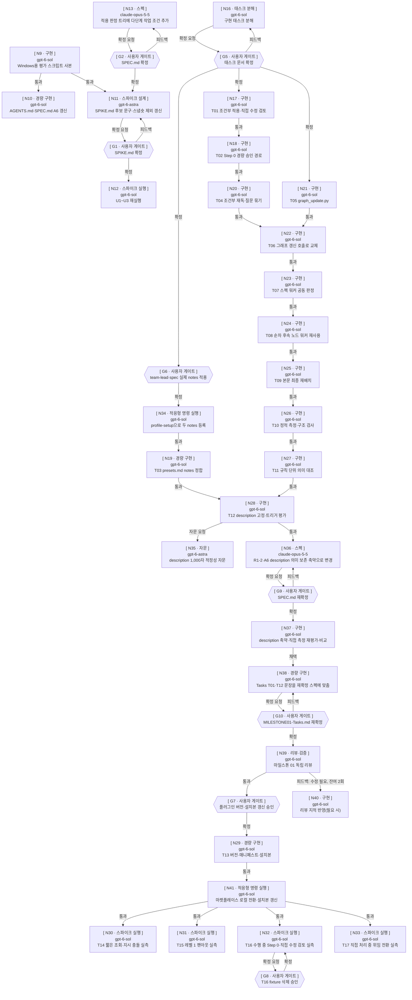

버전 : 0.11.0

| 노드 ID | 종류 | 프로필 | 입력 | 결과 파일 | 합격 기준 | 진행 조건 | 워크스페이스 | 되돌리기 | 재시도 | 검토 라운드 | 게이트 | 상태 | agentId |
| --- | --- | --- | --- | --- | --- | --- | --- | --- | --- | --- | --- | --- | --- |
| N9 | 워커 | 구현 — 원인이 특정된 결함 수정·검증 | 리더 브리핑 | nodes/N9.md / nodes/N9.failure.md | `~/.skywork/skill-trigger-eval/`의 수정 사본이 Windows에서 2질의 평가를 끝까지 돌려 `summary.total`=2 JSON을 냈는지 확인한다 | 즉시 | 공유(local) | 아니오 | 불가 | 해당 없음 | — | 완료 | d58f1379-1f96-4b25-b3ba-978a936ee3ef |
| N10 | 워커 | 경량 구현 — 정해진 문서 두 파일 수정 | nodes/N9.md | AGENTS.md · SPEC.md / nodes/N10.failure.md | `AGENTS.md:69` 줄에 개발 환경·사본 경로가 들어가고 `SPEC.md` A6 명령이 WSL 없이 사본 기준 Windows 명령으로 바뀌었는지 확인한다 | N9 완료 | 공유(local) | 아니오 | 가능 · 한도 1 · 사용 0 | 해당 없음 | — | 완료 | 9c441f11-7b27-410f-a3db-2e1759ed6245 |
| N11 | 워커 | 스파이크 설계 — 실험 설계 변경 | nodes/N9.md · nodes/N8.failure.md · spike-logs/snapshot-comparison.txt · nodes/N12.md · nodes/N12.failure.md · SPEC.md | SPIKE.md / nodes/N11.failure.md | `SPIKE.md`에서 WSL 전제가 사라지고 Windows 사본 기준 절차·스냅숏 비교 수정이 반영됐으며, 재작업 후 후보 description이 확정 SPEC의 트리와 같고 `file-history/`·`.claude.json.backup.*` 제외와 플러그인 격리 확인이 반영됐는지 확인한다 | N9 완료 · G2 확정 | 공유(local) | 아니오 | 가능 · 한도 1 · 사용 0 | 해당 없음 | — | 완료 | e4f3d0a5-e195-4aa3-85a5-32b04741751f |
| N13 | 워커 | 스펙 — 요구사항·수용 기준 변경 | 리더 브리핑 · SPEC.md | SPEC.md · nodes/N13.questions.md / nodes/N13.failure.md | `SPEC.md` 적용 판정 트리에 다단계 작업 조건이 들어가고 description·A6 평가 세트·관련 수용 기준이 그 트리와 어긋나지 않는지 확인한다 | 즉시 | 공유(local) | 아니오 | 가능 · 한도 1 · 사용 0 | 해당 없음 | — | 완료 | b4200b06-222d-4ff9-9a43-03ad929ce5b7 |
| G2 | 사용자 게이트 | — | SPEC.md | SPEC.md | 확정 대상 경로와 검토 시점 내용 해시를 적었는지 확인한다 | N13 완료 | 공유(local) | 아니오 | 불가 | 해당 없음 | SPEC.md · — · sha256 84e9f02b7f5c2dce · 확정 | 완료 | |
| G1 | 사용자 게이트 | — | SPIKE.md | SPIKE.md | 확정 대상 경로와 검토 시점 내용 해시를 적었는지 확인한다 | N11 완료 | 공유(local) | 아니오 | 불가 | 해당 없음 | SPIKE.md · — · sha256 e528ee21bb454007 · 확정(사용자 지시로 게이트 생략) | 완료 | |
| N12 | 워커 | 스파이크 실행 — 확정된 실험 실행 | SPIKE.md | nodes/N12.md / nodes/N12.round4.failure.md | U1~U3 각각의 판정(통과·실패·미판정)과 측정값·`claude -p` 사용 횟수가 결과 파일에 있는지 확인한다 | G1 확정 | 공유(local) | 아니오 | 불가 | 해당 없음 | — | 완료 | 0236258c-639b-41ef-88ff-492274fca12c |
| N16 | 워커 | 태스크 분해 — 확정 스펙을 세션 단위 태스크로 분해 | SPEC.md · nodes/N12.md | MILESTONE01-Tasks.md / nodes/N16.failure.md | `MILESTONE01-Tasks.md`가 SPEC 요구사항·수용 기준을 빠짐없이 태스크에 배정하고, 각 태스크가 대상 파일·완료 조건·검증 방법을 다른 문서 없이 알 수 있게 담았는지 확인한다 | 즉시(사용자가 마일스톤 생략 결정) | 공유(local) | 아니오 | 가능 · 한도 1 · 사용 0 | 해당 없음 | — | 완료 | eb79444e-6860-4876-86bd-6d72e6118802 |
| G5 | 사용자 게이트 | — | MILESTONE01-Tasks.md | MILESTONE01-Tasks.md | 확정 대상 경로와 검토 시점 내용 해시를 적었는지 확인한다 | N16 완료 | 공유(local) | 아니오 | 불가 | 해당 없음 | MILESTONE01-Tasks.md · — · sha256 da5a024e9d21ff90 · 확정 | 완료 | |
| N17 | 워커 | 구현 — 확정 설계·수용 기준으로 다중 파일 변경 | MILESTONE01-Tasks.md T01 · SPEC.md | SKILL.md · assets/review-briefing.md / nodes/N17.failure.md | MILESTONE01-Tasks.md T01의 완료 조건을 검증 방법 명령 출력으로 충족하는지 확인한다 | G5 확정 | 공유(local) | 아니오 | 가능 · 한도 1 · 사용 0 | 해당 없음 | — | 완료 | c3f5d366-c393-4d2b-a3c6-b8ba10550928 |
| N18 | 워커 | 구현 — 확정 설계·수용 기준으로 다중 파일 변경 | MILESTONE01-Tasks.md T02 · SPEC.md | SKILL.md · references/FORM.md / nodes/N18.failure.md | MILESTONE01-Tasks.md T02의 완료 조건을 검증 방법 명령 출력으로 충족하는지 확인한다 | N17 완료 | 공유(local) | 아니오 | 가능 · 한도 1 · 사용 0 | 해당 없음 | — | 완료 | ae440d55-3019-4ff9-bdd7-46888f65dba8 |
| G6 | 사용자 게이트 | — | list_profiles 조회값 | 실제 team-lead·spec notes | 사용자가 승인한 notes 문구와 profile-setup 적용 여부를 적었는지 확인한다 | G5 확정(사용자 승인 병렬화) | 공유(local) | 예 | 불가 | 해당 없음 | team-lead·spec notes 문구 · — · 사용자 승인(profile-setup 등록 포함) | 완료 |  |
| N19 | 워커 | 경량 구현 — 정해진 문서 한 파일 수정 | MILESTONE01-Tasks.md T03 · list_profiles 조회값 | references/presets.md / nodes/N19.failure.md | presets.md의 team-lead·spec notes가 list_profiles 실제 notes와 문자 단위로 같은지 확인한다 | N34 완료 | 공유(local) | 아니오 | 가능 · 한도 1 · 사용 0 | 해당 없음 | — | 완료 | 1b8eca90-29b6-432e-bb14-8b5df444b779 |
| N20 | 워커 | 구현 — 확정 설계·수용 기준으로 다중 파일 변경 | MILESTONE01-Tasks.md T04 · SPEC.md | SKILL.md · references/level1·level2·brainstorming.md / nodes/N20.failure.md | MILESTONE01-Tasks.md T04의 완료 조건을 검증 방법 명령 출력으로 충족하는지 확인한다 | N18 완료 | 공유(local) | 아니오 | 가능 · 한도 1 · 사용 0 | 해당 없음 | — | 완료 | 684ba30f-e78b-435d-aaa1-b18acbb1b8ad |
| N21 | 워커 | 구현 — 확정 설계·수용 기준으로 다중 파일 변경 | MILESTONE01-Tasks.md T05 · SPEC.md | scripts/graph_update.py / nodes/N21.failure.md | MILESTONE01-Tasks.md T05의 완료 조건을 검증 방법 명령 출력으로 충족하는지 확인한다 | G5 확정(사용자 승인 병렬화) | 공유(local) | 아니오 | 가능 · 한도 1 · 사용 0 | 해당 없음 | — | 완료 | e323b21b-1ec7-4e9d-96b7-2ede15d068af |
| N22 | 워커 | 구현 — 확정 설계·수용 기준으로 다중 파일 변경 | MILESTONE01-Tasks.md T06 · SPEC.md | SKILL.md · references/level1·level2·failure-handling.md / nodes/N22.failure.md | MILESTONE01-Tasks.md T06의 완료 조건을 검증 방법 명령 출력으로 충족하는지 확인한다 | N20 완료 · N21 완료 | 공유(local) | 아니오 | 가능 · 한도 1 · 사용 0 | 해당 없음 | — | 완료 | 5a23bc82-8891-41fb-a670-d9784f7cdd51 |
| N23 | 워커 | 구현 — 확정 설계·수용 기준으로 다중 파일 변경 | MILESTONE01-Tasks.md T07 · SPEC.md | SKILL.md · references/level2.md / nodes/N23.failure.md | MILESTONE01-Tasks.md T07의 완료 조건을 검증 방법 명령 출력으로 충족하는지 확인한다 | N22 완료 | 공유(local) | 아니오 | 가능 · 한도 1 · 사용 0 | 해당 없음 | — | 완료 | 59d36c2c-261d-4416-9907-555ac967ffdc |
| N24 | 워커 | 구현 — 확정 설계·수용 기준으로 다중 파일 변경 | MILESTONE01-Tasks.md T08 · SPEC.md | SKILL.md · references/level2·failure-handling·FORM.md / nodes/N24.failure.md | MILESTONE01-Tasks.md T08의 완료 조건을 검증 방법 명령 출력으로 충족하는지 확인한다 | N23 완료 | 공유(local) | 아니오 | 가능 · 한도 1 · 사용 0 | 해당 없음 | — | 완료 | 61958966-0d01-4c00-9b46-e352a2d9e3f0 |
| N25 | 워커 | 구현 — 확정 설계·수용 기준으로 다중 파일 변경 | MILESTONE01-Tasks.md T09 · SPEC.md | SKILL.md · references/level1·level2·system-prompt.md / nodes/N25.failure.md | MILESTONE01-Tasks.md T09의 완료 조건을 검증 방법 명령 출력으로 충족하는지 확인한다 | N24 완료 | 공유(local) | 아니오 | 가능 · 한도 1 · 사용 0 | 해당 없음 | — | 완료 | 5cbb2f0c-739a-4935-b150-b03f005533d3 |
| N26 | 워커 | 구현 — 확정 설계·수용 기준으로 다중 파일 변경 | MILESTONE01-Tasks.md T10 · SPEC.md | nodes/N26.md · link-audit.py (소스는 오류 시) / nodes/N26.failure.md | MILESTONE01-Tasks.md T10의 완료 조건을 검증 방법 명령 출력으로 충족하는지 확인한다 | N25 완료 | 공유(local) | 아니오 | 가능 · 한도 1 · 사용 0 | 해당 없음 | — | 완료 | ee14b348-e282-4bbd-bf1a-f1631b0bb566 |
| N27 | 워커 | 구현 — 확정 설계·수용 기준으로 다중 파일 변경 | MILESTONE01-Tasks.md T11 · SPEC.md | rule-audit.md · rule-audit.py · nodes/N27.md (소스는 오류 시) / nodes/N27.failure.md | MILESTONE01-Tasks.md T11의 완료 조건을 검증 방법 명령 출력으로 충족하는지 확인한다 | N26 완료 | 공유(local) | 아니오 | 가능 · 한도 1 · 사용 0 | 해당 없음 | — | 완료 | 704f75ba-2eba-46eb-969e-6fe183caa033 |
| N28 | 워커 | 구현 — 확정 설계·수용 기준으로 다중 파일 변경 | MILESTONE01-Tasks.md T12 · SPEC.md | SKILL.md description · a6-eval.json · a6-result.json · a6-stderr.log (재실행 시 a6-rerun-*) · nodes/N28.md / nodes/N28.failure.md | MILESTONE01-Tasks.md T12의 완료 조건을 검증 방법 명령 출력으로 충족하는지 확인한다 | N27 완료 · N19 완료 · A6 측정 수단을 실제 스킬 설치 직접 측정으로 변경(사용자 승인, SPEC.md 불변) | 공유(local) | 아니오 | 가능 · 한도 1 · 사용 0 | 해당 없음 | — | 완료 | 7924517f-c52a-48a8-8ec7-bfdcb804dd2b |
| G7 | 사용자 게이트 | — | 변경 규모 판정 | 두 plugin.json version | 승인된 버전 값과 설치본 갱신 승인을 적었는지 확인한다 | N28 완료 | 공유(local) | 예 | 불가 | 해당 없음 | 0.12.0(minor) · 설치본 갱신 승인 · 설치 경로 B(두 마켓플레이스를 워크트리 로컬 경로로 임시 전환, 실측 뒤 GitHub 복원) · 리뷰 합격 뒤 중간 커밋 승인 | 완료 |  |
| N29 | 워커 | 경량 구현 — 정해진 설정 두 파일 수정 | MILESTONE01-Tasks.md T13 · G7 승인값 | 두 plugin.json / nodes/N29.failure.md | 두 plugin.json version 0.12.0·name·description 일치, codex skills 유지, claude plugin validate(플러그인·마켓플레이스) 오류 0을 확인한다 | G7 확정 | 공유(local) | 아니오 | 불가 | 해당 없음 | — | 완료 | b2b35c42-7380-4126-b6a4-e59af53b53fc |
| N30 | 워커 | 스파이크 실행 — 확정된 실험 실행 | MILESTONE01-Tasks.md T14 · SPEC.md A8 | nodes/N30.md / nodes/N30.failure.md | MILESTONE01-Tasks.md T14 완료 조건의 측정값·판정이 결과 파일에 있는지 확인한다 | N29 완료 | 공유(local) | 아니오 | 불가 | 해당 없음 | — | 대기 | |
| N31 | 워커 | 스파이크 실행 — 확정된 실험 실행 | MILESTONE01-Tasks.md T15 · SPEC.md A8 | nodes/N31.md / nodes/N31.failure.md | MILESTONE01-Tasks.md T15 완료 조건의 측정값·판정이 결과 파일에 있는지 확인한다 | N29 완료 | 공유(local) | 아니오 | 불가 | 해당 없음 | — | 대기 | |
| N32 | 워커 | 스파이크 실행 — 확정된 실험 실행 | MILESTONE01-Tasks.md T16 · SPEC.md A8 | nodes/N32.md / nodes/N32.failure.md | MILESTONE01-Tasks.md T16 완료 조건의 측정값·판정이 결과 파일에 있는지 확인한다 | N29 완료 · G8 확정(삭제 단계) | 공유(local) | 아니오 | 불가 | 해당 없음 | — | 대기 | |
| N33 | 워커 | 스파이크 실행 — 확정된 실험 실행 | MILESTONE01-Tasks.md T17 · SPEC.md A8 | nodes/N33.md / nodes/N33.failure.md | MILESTONE01-Tasks.md T17 완료 조건의 측정값·판정이 결과 파일에 있는지 확인한다 | N29 완료 | 공유(local) | 아니오 | 불가 | 해당 없음 | — | 대기 | |
| G8 | 사용자 게이트 | — | N32 승인 요청 시점 | $fixture/port.lock 삭제 | 사용자 명시 승인과 승인 전 해시를 적었는지 확인한다 | N32 승인 요청 | 공유(local) | 예 | 불가 | 해당 없음 | — | 대기 | |
| N34 | 워커 | 적응형 명령 실행 — 워크스페이스 밖 환경 작업 | G6 승인 문구 | Paseo agentProfiles(team-lead·spec notes) / nodes/N34.failure.md | list_profiles의 team-lead·spec notes가 승인 문구와 문자 단위로 같고 다른 프로필·필드가 불변인지 확인한다 | G6 확정 | 공유(local) | 예(승인됨) | 불가 | 해당 없음 | — | 완료 | 2af757a0-510f-41a0-92d7-80d4cbf86067 |
| N35 | 워커 | 자문 — 사용자가 목적 승인(description 길이 적정성) | SKILL.md · SPEC.md R1-2·R1-10·A6 | nodes/N35.md / nodes/N35.failure.md | 약 1,000자 description의 적정성 판단과 근거(공식 문서·skill-creator 지침)가 결과 파일에 있는지 확인한다 | 사용자 승인 | 공유(local) | 아니오 | 불가 | 해당 없음 | — | 완료 | d81a7bd4-bdf9-4163-90de-bbde74ce0e6c |
| N36 | 워커 | 스펙 — 요구사항·수용 기준 변경 | SPEC.md · nodes/N35.md | SPEC.md · nodes/N36.questions.md / nodes/N36.failure.md | SPEC.md R1-2·A6가 자문 선택지 1(본문 트리 원문 유지, description 의미 보존 축약, 조건별 포함 확인+행동 평가)로 바뀌고 다른 요구사항과 어긋나지 않는지 확인한다 | N28 완료 · 사용자 지시 | 공유(local) | 아니오 | 가능 · 한도 1 · 사용 0 | 해당 없음 | — | 완료 | 44759d45-fd01-4fb0-bfb6-3178451c6b62 |
| G9 | 사용자 게이트 | — | SPEC.md | SPEC.md | 확정 대상 경로와 검토 시점 내용 해시를 적었는지 확인한다 | N36 완료 | 공유(local) | 아니오 | 불가 | 해당 없음 | SPEC.md · — · sha256 a1acb66b465ab3db · 확정 | 완료 |  |
| N37 | 워커 | 구현 — 확정 설계·수용 기준으로 다중 파일 변경 | SPEC.md(재확정) · a6-direct/ · backup/SKILL.md.desc987 | SKILL.md description · a6-short-*.json/log · nodes/N37.md / nodes/N37.failure.md | 축약 description이 재확정 A6 정적 조건을 통과하고 같은 평가 세트·직접 측정에서 A6 통과 여부와 987자판 비교가 결과 파일에 있는지 확인한다 | G9 확정 | 공유(local) | 아니오 | 가능 · 한도 1 · 사용 0 | 해당 없음 | — | 완료 | b92b7707-c88c-4298-8c66-476696744066 |
| N38 | 워커 | 경량 구현 — 정해진 문서 한 파일 수정 | SPEC.md(a1acb66b) · nodes/N36.questions.md · nodes/N37.md | MILESTONE01-Tasks.md / nodes/N38.failure.md | MILESTONE01-Tasks.md T01·T12의 충돌 줄이 재확정 SPEC R1-2·A6·C3와 맞고 다른 줄은 불변인지 확인한다 | N37 채택(사용자) | 공유(local) | 아니오 | 가능 · 한도 1 · 사용 0 | 해당 없음 | — | 완료 | 63337849-7d56-4ce4-addd-5d40f20be806 |
| G10 | 사용자 게이트 | — | MILESTONE01-Tasks.md | MILESTONE01-Tasks.md | 확정 대상 경로와 검토 시점 내용 해시를 적었는지 확인한다 | N38 완료 | 공유(local) | 아니오 | 불가 | 해당 없음 | MILESTONE01-Tasks.md · — · sha256 607c4972a82a167f · 확정 | 완료 |  |
| N39 | 워커 | 리뷰·검증 — 변경을 수용 기준과 대조, 대상 수정 안 함 | SPEC.md(a1acb66b) · git diff 5e833be | nodes/N39.md (2라운드 nodes/N39.round2.md) / nodes/N39.failure.md (2라운드 nodes/N39.round2.failure.md) | 결과 파일 첫 줄 구분 표지와 R1~R9·C1~C5·A1~A6 대조 판정·근거가 있는지 확인한다 | G10 확정 · 2라운드 지적(RUN/.gitattributes 범위 밖 추가)을 사용자 판단으로 비차단 수용해 리뷰 종료 | 공유(local) | 아니오 | 불가 | 상한 3 · 사용 2 | — | 완료 | 33d98ad4-4a28-44f2-ba11-0df2b6ece856 |
| N40 | 워커 | 구현 — 리뷰 지적 반영 | nodes/N39.md | m01-review.round2.patch / nodes/N40.failure.md | 리뷰 지적이 해소되고 정적 검사가 통과하는지 재검토로 확인한다 | N39 수정 필요 판정 | 공유(local) | 아니오 | 가능 · 한도 1 · 사용 0 | 해당 없음 | — | 완료 | 603c0e92-8788-4540-b567-3397aad2dc8d |
| N41 | 워커 | 적응형 명령 실행 — 워크스페이스 밖 환경 작업 | G7 승인(경로 B) · N29 결과 | 설치본(claude·codex) · nodes/N41.md / nodes/N41.failure.md | 두 마켓플레이스가 워크트리 로컬 경로를 가리키고 설치본 paseo-toolkit 0.12.0이 저장소 판본과 일치하며 원래 출처 설정이 기록됐는지 확인한다 | N29 완료 | 공유(local) | 예(승인됨) | 불가 | 해당 없음 | — | 대기 | |
