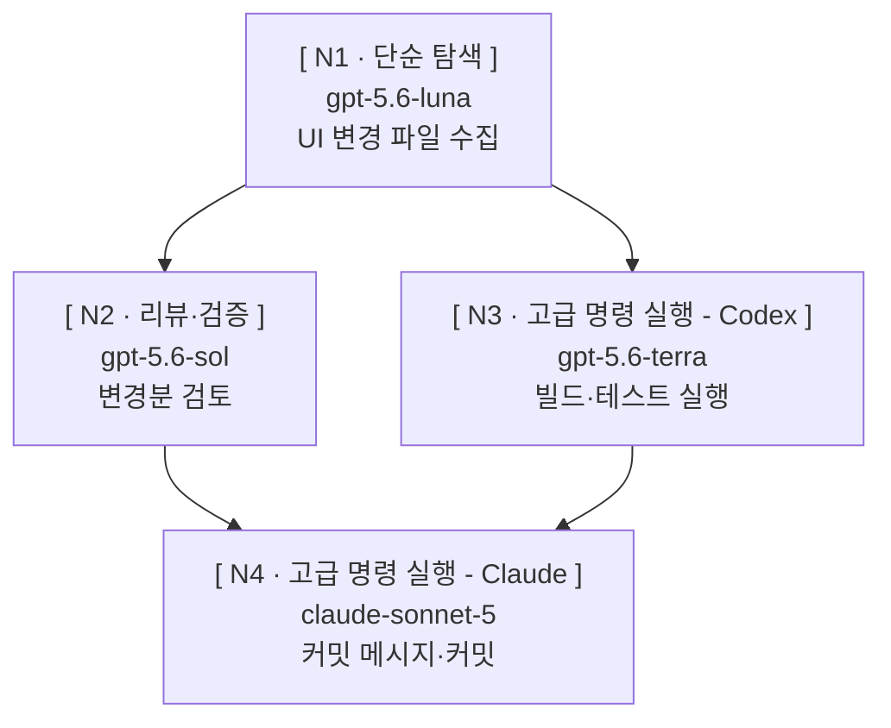
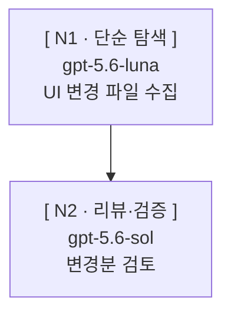

# 화면 양식

## 승인 화면

계획 승인 요청 때 출력하는 화면이다.

````text
### 목적 — UI 관련 변경분을 검토·검증한 뒤 커밋 1개로 남긴다



⚠️ [ **N4** ] 되돌리기 어려움 — 기동 전 별도 승인

기록 : `.skywork/paseo-orchestration/2026-09-09-ui-commit/GRAPH.md`
````

경고 줄이 없는 경우:

````text
### 목적 — UI 변경 파일을 수집한 뒤 검토한다



기록 : `.skywork/paseo-orchestration/2026-09-09-ui-review/GRAPH.md`
````

## 실행 기록

`GRAPH.md`에 두는 mermaid와 노드 표다. 아래는 스테이지 기동을 마친 뒤의 견본이다.

````text


| 노드 ID | 프로필 | 입력 | 결과 파일 | 합격 기준 | 워크스페이스 | 되돌리기 | 재시도 | 상태 | agentId |
| --- | --- | --- | --- | --- | --- | --- | --- | --- | --- |
| N1 | 단순 탐색 — UI 파일 수집 | 리더 브리핑 | nodes/N1.md / nodes/N1.failure.md | nodes/N1.md에 UI 변경 파일 목록이 있다 | 공유(local) | 아니오 | 가능 · 한도 1 · 사용 0 | 실행 중 | 8f2a1c4e-3b6d-4a91-9c0e-1d2b3a4c5d6e |
| N2 | 리뷰·검증 — 변경분 검토 | nodes/N1.md | nodes/N2.md / nodes/N2.failure.md | nodes/N2.md에 검토 결과가 있다 | 공유(local) | 아니오 | 가능 · 한도 1 · 사용 0 | 대기 | |
| N3 | 고급 명령 실행 - Codex — 빌드·테스트 | nodes/N1.md | nodes/N3.md / nodes/N3.failure.md | nodes/N3.md에 빌드·테스트 기록이 있다 | 공유(local) | 아니오 | 불가 | 대기 | |
| N4 | 고급 명령 실행 - Claude — 커밋 | nodes/N2.md · nodes/N3.md | nodes/N4.failure.md | nodes/N4.failure.md가 없다 | 공유(local) | 예 | 불가 | 대기 | |
````

스테이지 경계에서 상태를 갱신한 뒤:

````text
| 노드 ID | 프로필 | 입력 | 결과 파일 | 합격 기준 | 워크스페이스 | 되돌리기 | 재시도 | 상태 | agentId |
| --- | --- | --- | --- | --- | --- | --- | --- | --- | --- |
| N1 | 단순 탐색 — UI 파일 수집 | 리더 브리핑 | nodes/N1.md / nodes/N1.failure.md | nodes/N1.md에 UI 변경 파일 목록이 있다 | 공유(local) | 아니오 | 가능 · 한도 1 · 사용 0 | 완료 | 8f2a1c4e-3b6d-4a91-9c0e-1d2b3a4c5d6e |
| N2 | 리뷰·검증 — 변경분 검토 | nodes/N1.md | nodes/N2.md / nodes/N2.failure.md | nodes/N2.md에 검토 결과가 있다 | 공유(local) | 아니오 | 가능 · 한도 1 · 사용 0 | 실행 중 | 1a9b0c2d-4e5f-6789-abcd-ef0123456789 |
| N3 | 고급 명령 실행 - Codex — 빌드·테스트 | nodes/N1.md | nodes/N3.md / nodes/N3.failure.md | nodes/N3.md에 빌드·테스트 기록이 있다 | 공유(local) | 아니오 | 불가 | 실행 중 | 2b0c1d3e-5f60-789a-bcde-f01234567890 |
| N4 | 고급 명령 실행 - Claude — 커밋 | nodes/N2.md · nodes/N3.md | nodes/N4.failure.md | nodes/N4.failure.md가 없다 | 공유(local) | 예 | 불가 | 대기 | |
````

## 기동 보고

`{이름}`은 프로필 이름, `{작업}`은 맡은 일 한 줄이다. `{모델}`은 확인값
`provider/model [ thinkingOptionId ]`다. `{모드}`는 확인값 `currentModeId`이고, 모드가
없는 프로바이더는 `없음`으로 쓴다.

```text
이름 : {이름}
모델 : {provider}/{model} [ {thinkingOptionId} ]
모드 : {currentModeId}
작업 : {맡은 일 한 줄}
```

```text
이름 : 구현
모델 : grok/grok-4.6 [ xhigh ]
모드 : 없음
작업 : FORM.md 작성
```
