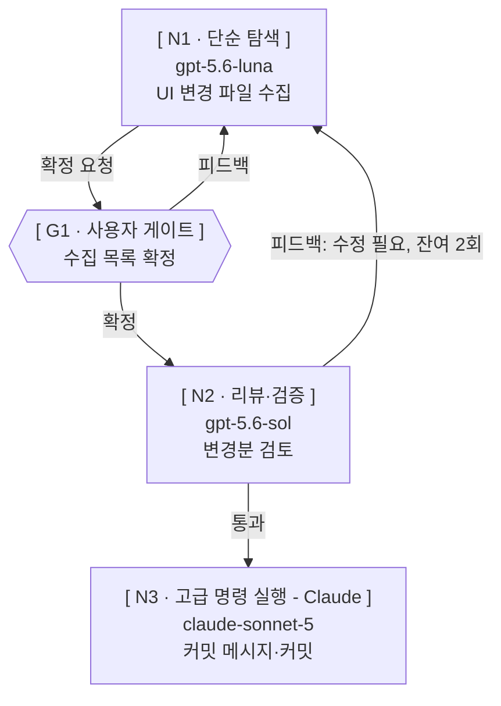
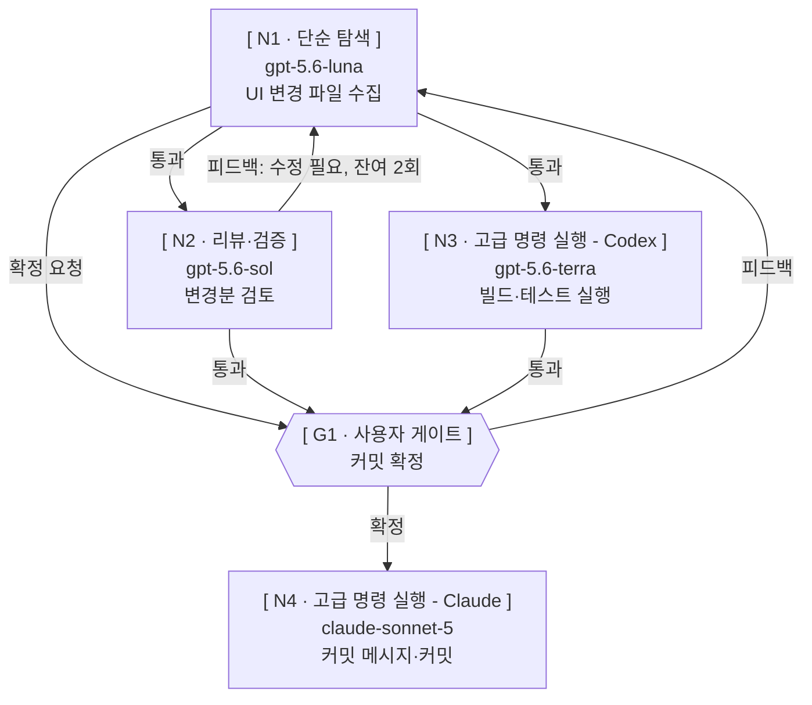
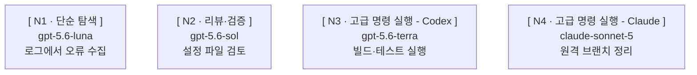

# 화면 양식

## 발화 지점 배정

팀장이 사용자에게 **먼저** 내는 자발 발화의 사건별 배정이다. 「즉시」는 발화하고 턴을 마쳐
답을 기다리는 것이고, 괄호는 그 사건이 걸리는 조건 번호다(2절 앞 「팀장 발화」의 네 조건).
「침묵」은 그 사건을 자발 발화로 내지 않는 것이고, 위임 경로의 침묵한 사실은 `GRAPH.md`와 완료 보고로
간다. **아래 `## 기동 보고`의 새 워커 기동 시점 출력은 이 표와 무관하게 낸다.**

| 사건 | 배정 |
| --- | --- |
| 브레인스토밍으로 보이는 요청을 받았다 | 즉시 (1) — 아래 `## 브레인스토밍 게이트`의 「진입」 |
| 브레인스토밍을 끊고 워크플로우 진입을 물어야 한다 | 즉시 (1) — 아래 `## 브레인스토밍 게이트`의 「진입 게이트」 |
| Paseo 도구가 이 세션에 붙어 있지 않다 | 즉시 (3) |
| 프로필 목록이 비어 있어 진행 여부를 물어야 한다 | 즉시 (1) |
| 적합한 프로필을 찾지 못해 프리셋으로 이번 실행용 값을 구성했다 | 침묵 → 완료 보고 |
| 프로필의 일부 범위만 배정하고 나머지를 분리했다 | 침묵 → 완료 보고 |
| 레벨 2로 판정했고 그 사유 | 침묵 (승인 화면으로 이어진다) |
| 레벨 2 계획 승인 화면 | 즉시 (1) |
| Step 0 경량 경로의 승인 요청 | 즉시 (1, 2) |
| 되돌리기 어려운 노드의 기동 직전 승인 | 즉시 (1, 2) |
| 워커를 기동했다 | 낸다 — 아래 `## 기동 보고` |
| 순차 후속 노드에 같은 워커를 재사용했다 | 침묵 → 완료 보고. 새 워커 기동 보고는 내지 않는다 |
| 확인한 모델·모드·thinking이 요청값과 다르다 | 침묵 → 완료 보고. 그 차이 때문에 그 노드가 맡은 작업을 끝낼 수 없으면 즉시 (3) |
| 활성 큐·대기 큐의 현재 개수 | 침묵 |
| 작성 워커의 결정 질문을 사용자에게 중계한다 | 즉시 (1) |
| 사용자 답변을 작성 워커에게 되돌려 보냈다 | 침묵 |
| 사용자 왕복을 한 번 더 돈다 | 침묵 (중계 자체는 위 행으로 즉시) |
| 공동 판정 결과가 「필요」 또는 「생략」으로 났다 | 침묵 → 완료 보고 |
| 공동 판정에 사업·제품 선택이 남았다 | 즉시 (1) |
| 사용자 확정 게이트를 연다 | 즉시 (1) |
| 검토 라운드를 소비했고 잔여 한도 안에서 재검토를 돈다 | 침묵 |
| 검토 라운드 상한을 소진했는데 지적이 남았다 | 즉시 (1, 3) |
| 재작업으로 되돌아간 노드 | 침묵 → 완료 보고. 재지시 내용이 범위 변경이면 위 「범위 변경 주입을 보내야 한다」 행으로 즉시 (1, 2) |
| 토론 라운드를 다 썼는데 수렴하지 않았다 | 즉시 (1, 3) |
| 자동 재시도 조건을 만족해 1회 재기동했다 | 침묵 → 완료 보고 |
| 재시도 금지로 분류된 실패가 났다 | 즉시 (3) |
| 실패 노드에 의존하는 노드를 미기동으로 남겼다 | 침묵 → 완료 보고. 선택된 경로의 남은 노드가 전부 막히면 즉시 (3) |
| 워커 권한 대기가 기존 승인 범위 안이다 | 침묵 |
| 워커 권한 대기가 승인 범위를 넘는다 | 즉시 (1, 2) |
| 권한이 명시적으로 거부됐다 | 즉시 (3) |
| 범위 변경 주입을 보내야 한다 | 즉시 (1, 2) |
| 프로바이더 장애를 판정했고 대체 여부를 물어야 한다 | 즉시 (1, 3) |
| 그래프 형태를 바꾸는 재설계가 필요하다 | 즉시 (1) |
| `GRAPH.md` 기록과 조회한 실제 상태가 다르다 | 즉시 (4) |
| 레벨 1 실행 중 작업 사이의 의존을 뒤늦게 발견했다 | 즉시 (1) |
| 쪼개기·프로필 선택·그래프 설계의 과정 | 침묵 |
| 전원 판정이 끝났다 | 완료 보고 |

표에 없는 사건은 위 네 조건으로 직접 판정한다.

## 브레인스토밍 게이트

SKILL.md 10절의 진입 물음과 `references/brainstorming.md`의 워크플로우 진입 게이트에서 내는
화면 둘이다. 라벨 뒤는 ` : `(공백-콜론-공백)이고 경로는 아래 `경로 표기 규칙`을 따른다.

**진입** — 브레인스토밍으로 보이는 요청을 받았을 때 낸다. 무엇을 같이 정할지 한 줄로 밝혀
사용자가 뒤집을 수 있게 한다.

```text
브레인스토밍으로 보입니다 — {같이 정할 것 한 줄}. 브레인스토밍을 진행해볼까요?
```

**진입 게이트** — 브레인스토밍을 끊고 `BRAINSTORMING.md`를 쓴 뒤에 낸다.

```text
정리 : `.skywork/paseo-orchestration/2026-09-19-graph-panel/BRAINSTORMING.md`
고른 방향 : {한 줄}
스펙 작성부터 워크플로우를 실행해볼까요?
```

`고른 방향`은 사용자가 실제로 고른 것만 적는다. 좁혀지지 않은 채 끊었으면 그 줄에 남은
선택지를 적고 고른 것처럼 쓰지 않는다.

## 목적 머리말

레벨 1의 첫 기동 시점과 레벨 2의 승인 화면에서 **같은 표기**를 쓴다.

- 표기 — `### 목적 — {한 문장}`. 헤딩 단계는 `###` 그대로 두고 낮추거나 없애지 않는다.
- 길이 — `— ` 뒤의 본문이 **공백을 포함해 60자 이내**다. `### 목적 — ` 표기는 세지 않는다.
- 문장 수 — 한 문장이다. 마침표·물음표로 끝나는 문장을 둘 이상 쓰지 않는다.
- 60자를 넘으면 노드 목록·조건·산출물 이름·근거를 빼고 **이번 실행이 무엇을 만드는지**만
  남긴다. 줄을 바꾸어 두 줄로 만들지 않는다.

## 승인 화면

계획 승인 요청 때 출력하는 화면이다. **목적 머리말 → mermaid → `GRAPH.md` 경로 셋으로
끝난다.** 노드 표와 되돌리기 경고 줄을 내지 않는다 — 노드 표는 `GRAPH.md`에만 두고, 되돌리기
어려운 노드는 그 노드 기동 **직전의** 별도 승인으로 받는다(SKILL.md 도입부 Step 0).

**예외는 프루닝 안내 하나다** — 위 셋에 더해지는 네 번째 출력물이고, 노드 표와 되돌리기 경고
줄을 내지 않는 금지는 그대로다. 그래프에 스펙 작성 노드·스파이크 필요성 공동 판정 노드·마일스톤
필요성 공동 판정 노드 중 **하나라도 있으면** 아래 문구를 내고, 하나도 없으면 위 셋으로
끝낸다. 자리는 `GRAPH.md` 경로 줄 **뒤**인 화면의 **맨 마지막**이다.

```text
{들어 있는 것}이 들어 있습니다. 이미 확정됐거나 필요 없으면 노드 ID로
알려주세요. 지금 계획대로 실행하려면 승인해 주세요 — 승인 즉시 기동합니다.
```

`{들어 있는 것}` 자리에는 **그 그래프에 실제로 있는 노드의 이름만** 적는다. 없는 노드의 이름을
적지 않고, 셋을 다 늘어놓은 고정 문구로 쓰지 않는다. 둘 이상이면 아래 표 순서대로 `·`로 잇는다.
뒤 두 문장은 무엇이 들어 있든 그대로 둔다.

| 그래프에 있는 노드 | `{들어 있는 것}`에 적는 이름 |
| --- | --- |
| 스펙 작성 노드 | 스펙 작성 |
| 스파이크 필요성 공동 판정 노드 | 스파이크 판정 |
| 마일스톤 필요성 공동 판정 노드 | 마일스톤 판정 |

스펙 작성 노드 하나만 있으면 첫 문장은 `스펙 작성이 들어 있습니다.`이고, 스파이크·마일스톤
판정 둘만 있으면 `스파이크 판정·마일스톤 판정이 들어 있습니다.`다.

mermaid에는 실행 중 고를 수 있는 경로가 모두 그려져 있어야 한다 — 공동 판정의 `필요`·`생략`
두 엣지, 작성 노드와 사용자 게이트 사이의 양방향 엣지(`확정 요청`·`피드백`), 독립 검토 노드를
실제로 둔 단계의 검토 → 작성 피드백 엣지와 잔여 라운드 한도.

````text
### 목적 — UI 변경분을 검토한 뒤 커밋 1개로 남긴다



기록 : `.skywork/paseo-orchestration/2026-09-09-ui-commit/GRAPH.md`
````

이 견본 그래프에는 스펙 작성·스파이크 판정·마일스톤 판정 어느 노드도 없으므로 프루닝 안내를
내지 않고 위 셋으로 끝냈다.

## 실행 기록

`GRAPH.md`에 두는 mermaid와 노드 표다. 기본 표는 스테이지 기동을 마친 뒤의 견본이다. 맨 위 `버전 : ` 줄은 규칙 본문이 정한 자리이고, 아래 견본이 그 표기(라벨 `버전`, 구분자 ` : `)를 고정한다.

````text
버전 : {플러그인 버전}



| 노드 ID | 종류 | 프로필 | 입력 | 결과 파일 | 합격 기준 | 진행 조건 | 워크스페이스 | 되돌리기 | 재시도 | 검토 라운드 | 게이트 | 상태 | agentId |
| --- | --- | --- | --- | --- | --- | --- | --- | --- | --- | --- | --- | --- | --- |
| N1 | 워커 | 단순 탐색 — UI 파일 수집 | 리더 브리핑 | nodes/N1.md / nodes/N1.failure.md | UI 변경 파일 목록을 실제로 수집했는지 확인한다 | 즉시 | 공유(local) | 아니오 | 가능 · 한도 1 · 사용 0 | 해당 없음 | — | 실행 중 | 8f2a1c4e-3b6d-4a91-9c0e-1d2b3a4c5d6e |
| N2 | 워커 | 리뷰·검증 — 변경분 검토 | nodes/N1.md | nodes/N2.md / nodes/N2.failure.md | 원본 수용 조건을 모두 통과했는지 확인한다 | N1 완료 | 공유(local) | 아니오 | 가능 · 한도 1 · 사용 0 | 상한 3 · 사용 0 | — | 대기 | |
| N3 | 워커 | 고급 명령 실행 - Codex — 빌드·테스트 | nodes/N1.md | nodes/N3.md / nodes/N3.failure.md | 빌드·테스트를 실제로 실행한 결과가 있는지 확인한다 | N1 완료 | 공유(local) | 아니오 | 불가 | 해당 없음 | — | 대기 | |
| G1 | 사용자 게이트 | — | nodes/N2.md · nodes/N3.md | src/App.vue | 확정 대상 경로와 검토 시점 내용 해시를 적었는지 확인한다 | N2 완료 · N3 완료 | 공유(local) | 아니오 | 불가 | 상한 3 · 사용 0 | src/App.vue · N2 · 확정 대기 | 대기 | |
| N4 | 워커 | 고급 명령 실행 - Claude — 커밋 | nodes/N2.md · nodes/N3.md | nodes/N4.failure.md | 워커가 종료되었고 커밋이 실제로 만들어졌는지 확인한다 | G1 확정 | 공유(local) | 예 | 불가 | 해당 없음 | — | 대기 | |
````

판정 뒤에는 기본 표의 변경된 셀만 갱신한다.

| 노드 | 변경할 셀 |
| --- | --- |
| N1 | 상태 = 완료 |
| N2 | 상태 = 완료; agentId = 1a9b0c2d-4e5f-6789-abcd-ef0123456789; 검토 라운드 = 상한 3 · 사용 1 |
| N3 | 상태 = 실행 중; agentId = 2b0c1d3e-5f60-789a-bcde-f01234567890 |
| G1 | 검토 라운드 = 상한 3 · 사용 1 |

나머지 셀과 N4 행은 그대로 둔다.

레벨 1(엣지 없는 팬아웃)은 작업 사이에 의존이 없으므로 노드 사이에 화살표를 그리지 않고 각 노드를 따로 나열한다. 아래는 활성 큐 기동을 마친 뒤의 견본이다 — 되돌리기 `예`인 N4는 기동 직전 별도 승인을 기다리므로 `대기`이고 `agentId`가 비어 있다.

````text


````

레벨 1도 위 기본 표와 같은 14열을 쓴다. 독립 노드는 입력을 리더 브리핑, 진행 조건을 즉시로 둔다. 기동한 노드는 `실행 중`과 실제 `agentId`를 적는다. 되돌리기 승인을 기다리는 N4는 `대기`로 두고 `agentId`를 비운다.

사용자 게이트 행의 `상태`는 세 단계를 지난다 — 게이트를 열기 전에는 위 견본처럼 `대기`이고,
팀장이 그 게이트를 열어 확정 요청 출력을 낸 시점에 `실행 중`, 사용자가 확정하면 `완료`다.
게이트용 상태 값을 새로 만들지 않고, 게이트 행의 `agentId`는 비워 둔다.

## 기동 보고

새 워커를 기동했을 때 기본은 네 줄이고 라벨은 `이름` / `모델` / `모드` / `작업`이다. 라벨 뒤는 ` : `(공백-콜론-공백)다.
`이름`은 프로필 이름, `작업`은 맡은 일 한 줄이다. `모델`은 `provider/model [ thinkingOptionId ]`
이고 확인값(`snapshot.model`·`snapshot.effectiveThinkingOptionId`)을 쓴다. `모드`는
확인값(`currentModeId`)이고, 모드가 없는 프로바이더는 `없음`으로 쓴다. mermaid 라벨에는 모델명만, 기동 보고에는 provider/model과 thinkingOptionId를 쓴다.

```text
이름 : {이름}
모델 : {provider}/{model} [ {thinkingOptionId} ]
모드 : {currentModeId}
작업 : {맡은 일 한 줄}
```

워커 하나당 코드블록 하나다. 여러 개를 띄웠으면 블록을 연달아 놓고, 한 블록에 여러 건을 넣지
않으며 표로 바꾸지 않는다. **코드블록에 `기록` 줄을 붙이지 않는다** — `GRAPH.md` 경로는 실행당
한 번만 내고 워커 수만큼 반복하지 않는다.

레벨 1은 그 실행에서 **처음** 워커를 기동할 때만 코드블록들 앞에 목적 머리말 한 줄과
`GRAPH.md` 경로 한 줄을 낸다. 경로는 `기록 : ` 뒤에 쓴다. **mermaid 블록은 내지 않는다** — 그래프는 `GRAPH.md`에만 있다.
두 번째 이후 기동에는 그때 기동한 워커의 코드블록만 낸다.

레벨 2는 승인 화면에서 목적 머리말과 `GRAPH.md` 경로를 이미 냈으므로 기동 시점에는 워커
코드블록만 낸다.

## 완료 보고

전원 판정이 끝난 뒤 팀장이 내는 최종 취합 보고다. 작업별 상태(`완료`·`실패`·`미기동`·`생략`)와
완료된 결과 파일 경로를 내고, 침묵한 사건 중 아래는 **반드시** 넣는다.

- 프리셋으로 이번 실행용 값을 구성한 노드와 그 사실.
- 자동 재시도를 사용한 노드와 사용 횟수.
- 소비한 검토 라운드 수.
- 확인한 모델·모드·thinking이 요청값과 다른 노드와 그 확인값.
- 실패 노드에 막혀 미기동으로 남은 노드.
- 재작업으로 되돌아간 노드와 그 사실.
- 같은 워커를 재사용한 후속 노드와 재사용 `agentId`.

그 밖의 상태 전이는 `GRAPH.md` 기록으로만 남긴다.

## 경로 표기 규칙

화면에 경로를 낼 때는 워크스페이스 루트 기준 상대 경로를 백틱으로 감싼다 —
`.skywork/paseo-orchestration/2026-09-15-form/GRAPH.md`. 파일명만 쓰지 않고, 마크다운 링크로
만들지 않는다. 절대 경로는 기존 규칙이 요구할 때만 쓴다.

## 사용자 확정 게이트

`python3`가 없으면 Python 명령을 `python`으로 실행한다.

산출물 확정을 받아야 다음 단계로 넘어갈 때 낸다. 경로는 위 `경로 표기 규칙`을 따른다. **이
출력을 낸 시점에 `python3 scripts/graph_update.py set`으로 `GRAPH.md`의 그 게이트 행 `상태`를 `실행 중`으로 바꾸고, 사용자가 확정하면
`python3 scripts/graph_update.py set`으로 `완료`로 바꾼다.** 그 단계에 독립 검토 노드를 실제로 두었으면 검토 줄을 넣고, 두지 않았으면
넣지 않는다.

```text
산출물 : `.skywork/paseo-orchestration/2026-09-15-form/SPEC.md`
검토 : 통과 · 남은 라운드 1
확정 대기 — 사용자 확정을 기다린다
```
