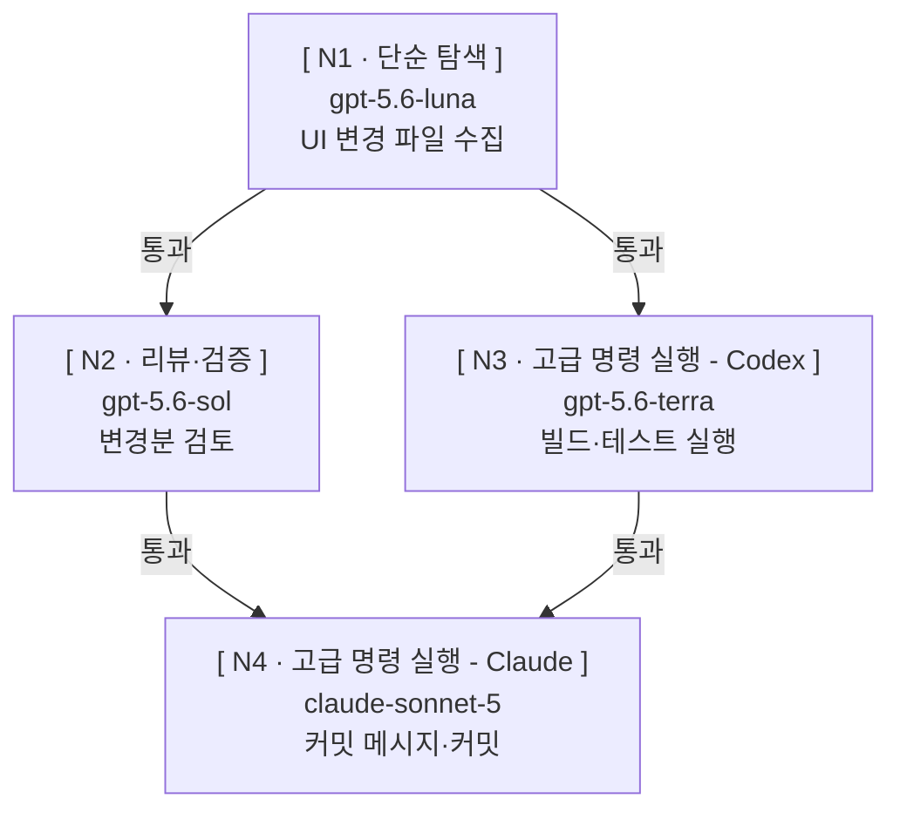
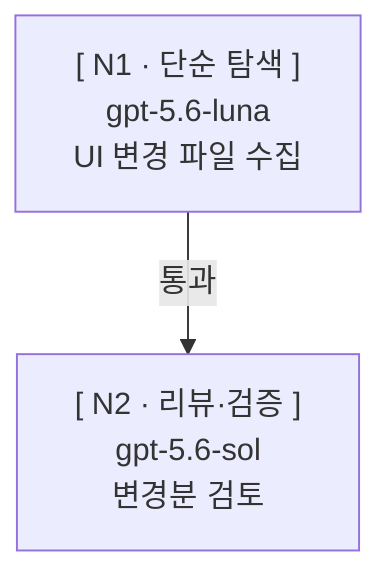
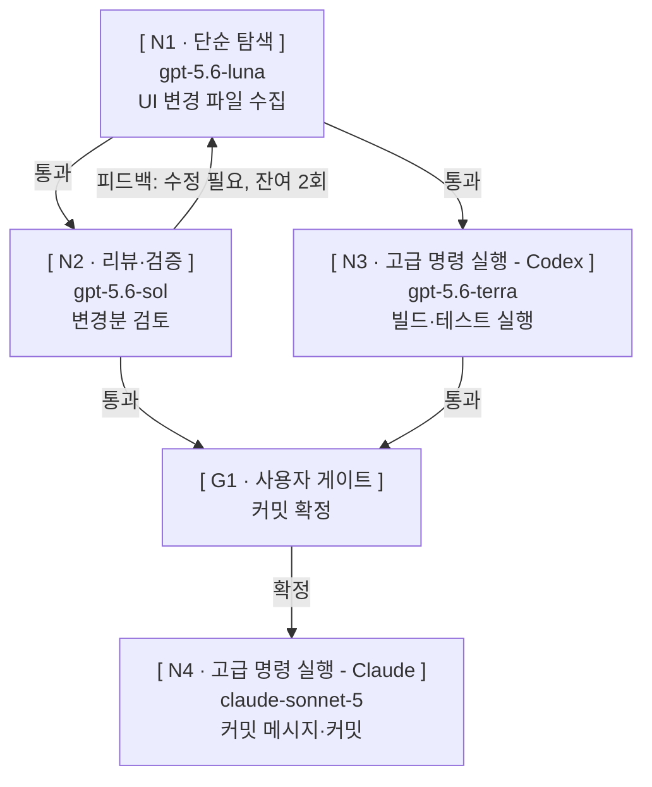
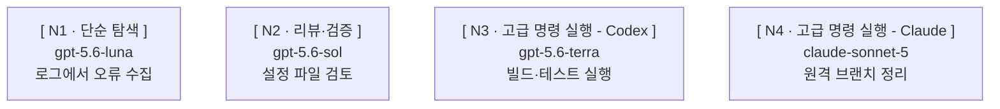
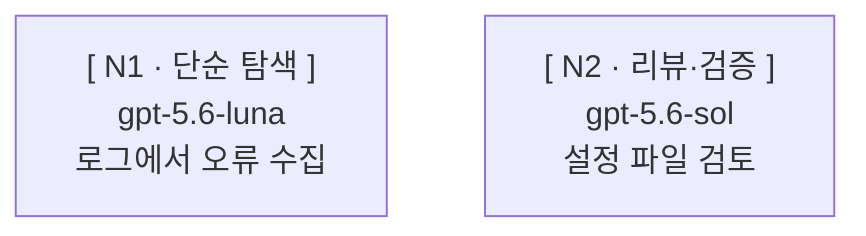

# 화면 양식

## 승인 화면

계획 승인 요청 때 출력하는 화면이다.

````text
### 목적 — UI 관련 변경분을 검토·검증한 뒤 커밋 1개로 남긴다



⚠️ [ **N4** ] 되돌리기 어려움 — 기동 전 별도 승인

기록 : `.skywork/paseo-orchestration/2026-09-09-ui-commit/GRAPH.md`
````

경고 줄이 없는 경우:

````text
### 목적 — UI 변경 파일을 수집한 뒤 검토한다



기록 : `.skywork/paseo-orchestration/2026-09-09-ui-review/GRAPH.md`
````

## 실행 기록

`GRAPH.md`에 두는 mermaid와 노드 표다. 아래는 스테이지 기동을 마친 뒤의 견본이다.

````text


| 노드 ID | 종류 | 프로필 | 입력 | 결과 파일 | 합격 기준 | 진행 조건 | 워크스페이스 | 되돌리기 | 재시도 | 검토 라운드 | 게이트 | 상태 | agentId |
| --- | --- | --- | --- | --- | --- | --- | --- | --- | --- | --- | --- | --- | --- |
| N1 | 워커 | 단순 탐색 — UI 파일 수집 | 리더 브리핑 | nodes/N1.md / nodes/N1.failure.md | UI 변경 파일 목록을 실제로 수집했는지 확인한다 | 즉시 | 공유(local) | 아니오 | 가능 · 한도 1 · 사용 0 | 해당 없음 | — | 실행 중 | 8f2a1c4e-3b6d-4a91-9c0e-1d2b3a4c5d6e |
| N2 | 워커 | 리뷰·검증 — 변경분 검토 | nodes/N1.md | nodes/N2.md / nodes/N2.failure.md | 원본 수용 조건을 모두 통과했는지 확인한다 | N1 완료 | 공유(local) | 아니오 | 가능 · 한도 1 · 사용 0 | 상한 3 · 사용 0 | — | 대기 | |
| N3 | 워커 | 고급 명령 실행 - Codex — 빌드·테스트 | nodes/N1.md | nodes/N3.md / nodes/N3.failure.md | 빌드·테스트를 실제로 실행한 결과가 있는지 확인한다 | N1 완료 | 공유(local) | 아니오 | 불가 | 해당 없음 | — | 대기 | |
| G1 | 사용자 게이트 | — | nodes/N2.md · nodes/N3.md | src/App.vue | 확정 대상 경로와 검토 시점 내용 해시를 적었는지 확인한다 | N2 완료 · N3 완료 | 공유(local) | 아니오 | 불가 | 상한 3 · 사용 0 | src/App.vue · N2 · 확정 대기 | 대기 | |
| N4 | 워커 | 고급 명령 실행 - Claude — 커밋 | nodes/N2.md · nodes/N3.md | nodes/N4.failure.md | 워커가 종료되었고 커밋이 실제로 만들어졌는지 확인한다 | G1 확정 | 공유(local) | 예 | 불가 | 해당 없음 | — | 대기 | |
````

스테이지 경계에서 상태를 갱신한 뒤:

````text
| 노드 ID | 종류 | 프로필 | 입력 | 결과 파일 | 합격 기준 | 진행 조건 | 워크스페이스 | 되돌리기 | 재시도 | 검토 라운드 | 게이트 | 상태 | agentId |
| --- | --- | --- | --- | --- | --- | --- | --- | --- | --- | --- | --- | --- | --- |
| N1 | 워커 | 단순 탐색 — UI 파일 수집 | 리더 브리핑 | nodes/N1.md / nodes/N1.failure.md | UI 변경 파일 목록을 실제로 수집했는지 확인한다 | 즉시 | 공유(local) | 아니오 | 가능 · 한도 1 · 사용 0 | 해당 없음 | — | 완료 | 8f2a1c4e-3b6d-4a91-9c0e-1d2b3a4c5d6e |
| N2 | 워커 | 리뷰·검증 — 변경분 검토 | nodes/N1.md | nodes/N2.md / nodes/N2.failure.md | 원본 수용 조건을 모두 통과했는지 확인한다 | N1 완료 | 공유(local) | 아니오 | 가능 · 한도 1 · 사용 0 | 상한 3 · 사용 1 | — | 완료 | 1a9b0c2d-4e5f-6789-abcd-ef0123456789 |
| N3 | 워커 | 고급 명령 실행 - Codex — 빌드·테스트 | nodes/N1.md | nodes/N3.md / nodes/N3.failure.md | 빌드·테스트를 실제로 실행한 결과가 있는지 확인한다 | N1 완료 | 공유(local) | 아니오 | 불가 | 해당 없음 | — | 실행 중 | 2b0c1d3e-5f60-789a-bcde-f01234567890 |
| G1 | 사용자 게이트 | — | nodes/N2.md · nodes/N3.md | src/App.vue | 확정 대상 경로와 검토 시점 내용 해시를 적었는지 확인한다 | N2 완료 · N3 완료 | 공유(local) | 아니오 | 불가 | 상한 3 · 사용 1 | src/App.vue · N2 · 확정 대기 | 대기 | |
| N4 | 워커 | 고급 명령 실행 - Claude — 커밋 | nodes/N2.md · nodes/N3.md | nodes/N4.failure.md | 워커가 종료되었고 커밋이 실제로 만들어졌는지 확인한다 | G1 확정 | 공유(local) | 예 | 불가 | 해당 없음 | — | 대기 | |
````

레벨 1(엣지 없는 팬아웃)은 작업 사이에 의존이 없으므로 노드 사이에 화살표를 그리지 않고 각 노드를 따로 나열한다. 아래는 활성 큐 기동을 마친 뒤의 견본이다 — 되돌리기 `예`인 N4는 기동 직전 별도 승인을 기다리므로 `대기`이고 `agentId`가 비어 있다.

````text


| 노드 ID | 종류 | 프로필 | 입력 | 결과 파일 | 합격 기준 | 진행 조건 | 워크스페이스 | 되돌리기 | 재시도 | 검토 라운드 | 게이트 | 상태 | agentId |
| --- | --- | --- | --- | --- | --- | --- | --- | --- | --- | --- | --- | --- | --- |
| N1 | 워커 | 단순 탐색 — 로그 오류 수집 | 리더 브리핑 | nodes/N1.md / nodes/N1.failure.md | 로그에서 오류 목록을 실제로 수집했는지 확인한다 | 즉시 | 공유(local) | 아니오 | 가능 · 한도 1 · 사용 0 | 해당 없음 | — | 실행 중 | 8f2a1c4e-3b6d-4a91-9c0e-1d2b3a4c5d6e |
| N2 | 워커 | 리뷰·검증 — 설정 파일 검토 | 리더 브리핑 | nodes/N2.md / nodes/N2.failure.md | 원본 수용 조건을 모두 통과했는지 확인한다 | 즉시 | 공유(local) | 아니오 | 가능 · 한도 1 · 사용 0 | 상한 3 · 사용 0 | — | 실행 중 | 1a9b0c2d-4e5f-6789-abcd-ef0123456789 |
| N3 | 워커 | 고급 명령 실행 - Codex — 빌드·테스트 | 리더 브리핑 | nodes/N3.md / nodes/N3.failure.md | 빌드·테스트를 실제로 실행한 결과가 있는지 확인한다 | 즉시 | 공유(local) | 아니오 | 불가 | 해당 없음 | — | 실행 중 | 2b0c1d3e-5f60-789a-bcde-f01234567890 |
| N4 | 워커 | 고급 명령 실행 - Claude — 원격 브랜치 정리 | 리더 브리핑 | nodes/N4.failure.md | 워커가 종료되었고 원격 브랜치가 실제로 정리되었는지 확인한다 | N1 완료 · N2 완료 · N3 완료 | 공유(local) | 예 | 불가 | 해당 없음 | — | 대기 | |
````

## 기동 보고

기본은 네 줄이고 라벨은 `이름` / `모델` / `모드` / `작업`이다. 라벨 뒤는 ` : `(공백-콜론-공백)다.
레벨 1은 `기록` 줄을 하나 더 붙인다 — `references/level1.md`의 「레벨 1의 `GRAPH.md` 기록」에서
알리기로 한 `GRAPH.md` 경로다. 레벨 2는 승인 화면에서 이미 알렸으므로 붙이지 않는다.
`이름`은 프로필 이름, `작업`은 맡은 일 한 줄이다. `모델`은 `provider/model [ thinkingOptionId ]`
이고 확인값(`snapshot.model`·`snapshot.effectiveThinkingOptionId`)을 쓴다. `모드`는
확인값(`currentModeId`)이고, 모드가 없는 프로바이더는 `없음`으로 쓴다. mermaid 라벨은
「어떤 그래프로 작업되는가」가 목적이라 모델명만 담고, 이 안내는
「어떤 에이전트가 무엇을 맡았는가」가 목적이라 두 형식을 같게 맞추지 않는다.

```text
이름 : {이름}
모델 : {provider}/{model} [ {thinkingOptionId} ]
모드 : {currentModeId}
작업 : {맡은 일 한 줄}
```

```text
이름 : 구현
모델 : grok/grok-4.6 [ xhigh ]
모드 : 없음
작업 : FORM.md 작성
```

레벨 1은 워커 코드블록들 앞에 머리말을 1회 낸다 — `### 목적 —` 한 줄과 mermaid 블록이다.
mermaid는 `GRAPH.md`에 쓴 블록의 사본이고 리더(생성자)는 넣지 않는다. 노드 표는 내지 않는다.

````text
### 목적 — 로그 오류와 설정 파일을 나눠 조사한다


````

머리말 뒤에 워커 코드블록이 하나씩 이어진다. 레벨 1은 `기록` 줄을 더한다.

```text
이름 : 구현
모델 : grok/grok-4.6 [ xhigh ]
모드 : 없음
작업 : FORM.md 작성
기록 : `.skywork/paseo-orchestration/2026-09-13-form-wording/GRAPH.md`
```

## 경로 표기 규칙

화면에 경로를 낼 때는 워크스페이스 루트 기준 상대 경로를 백틱으로 감싼다 —
`.skywork/paseo-orchestration/2026-09-15-form/GRAPH.md`. 파일명만 쓰지 않고, 마크다운 링크로
만들지 않는다. 절대 경로는 기존 규칙이 요구할 때만 쓴다.

## 사용자 확정 게이트

산출물 확정을 받아야 다음 단계로 넘어갈 때 낸다. 경로는 위 `경로 표기 규칙`을 따른다.

```text
산출물 : `.skywork/paseo-orchestration/2026-09-15-form/SPEC.md`
검토 : 통과 · 남은 라운드 1
확정 대기 — 사용자 확정을 기다린다
```
